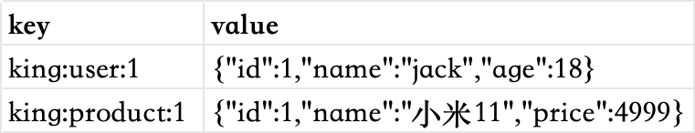
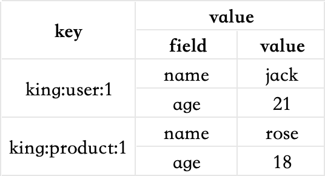

# Redis的介绍

redis是一个基于内存的键值型nosql数据库。 特征：

- 键值型，value支持多种不同数据结构，功能丰富。
- 单线程，每个命令具备原子性
- 低延迟，速度快（基于内存，IO多路复用，良好的编码）
- 支持数据持久化
- 支持主从集群，分片集群
- 支持多语言客户端

redis的安装，由于本人是macos系统，所以采用的是homebrew的方式进行的安装。其他系统的安装参照网上相关的文档即可。
在启动redis服务之前，一般需要对redis的配置文件进行修改，主要修改的几个地方如下

```properties
#监听的地址，默认是127.0.0.1，只能在本地访问。一般会改成0.0.0.0，可以在任意ip地址访问。
bind 0.0.0.0
#守护进程，修改为yes可以后台启动服务
daemonize yes
#密码，根据需要进行设定
requirepass 123456
```

# 数据结构

redis是一个key-value的数据库，key一般是string类型，不过value的类型多种多样。基本的类型包含string、list、hash、set、zset，特殊类型一般常用的有geo、bitmap、hyperloglog。

# 通用命令

通用命令是部分数据类型的，都可以使用的命令，常见的有：

- keys 查看所有符合模版的key
- del 删除一个指定的key
- exists 判断一个key是否存在
- expire 给一个key设置有效期，有效期到期时该key会被自动删除
- ttl 查看一个key的剩余有效期

# string

string也就是字符串类型，是redis中最简单的存储类型。其value值是字符串，不过根据字符串的格式的不同，又可以分为3类

- string 普通字符串
- int 整数类型，可以做自增自减操作
- float 浮点类型，可以做自增自减操作

不管是哪种格式，底层都是字节数组形式存储，只不过是编码方式不同。字符串类型的最大空间不能超过512m

string的常见命令有

- set 添加或者修改已经存在的一个string类型的键值对
- get 根据key获取string类型的value
- mset 批量添加多个string类型的键值对
- mget 根据多个key获取多个string类型的value
- incr 让一个整型的key自增1
- incrby 让一个整型的key自增并指定步长，例如：incrby num 2，让num值自增2
- incrbyfloat 让一个浮点类型的数字自增并指定步长
- setnx 添加一个string类型的键值对，前提是这个key不存在，否则不执行
- setex 添加一个string类型的键值对，并且指定有效期

**【拓展】key和value的结构**

redis的key允许有多个单词形成层级结构，多个单词之间使用冒号“:”隔开，格式如下

```
项目名:业务名:类型:id
```

这个格式并非固定，可以根据自己的需求来删除或者添加词条。

例如项目是king，有user和product两种不同类型的数据，可以这样定义key

* user相关的key：king:user:1
* product相关的key：king:product:1

如果value是一个java对象，则可以将对象序列化成json字符串后存储，比如



# hash

hash类型，也叫散列，其value是一个无序字典，类似于java中的hashmap结构。

string结构是将对象序列化为json字符串后存储，当需要修改对象某个字段时很不方便。


hash结构可以将对象中的每个字段独立存储，可以针对单个字段做crud



hash的常见命令有

* hset key field value 添加或者修改hash类型key的field的值
* hget key field 获取一个hash类型key的field的值
* hmset 批量添加多个hash类型key的field的值
* hmget 批量获取多个hash类型key的field的值
* hgetall 获取一个hash类型的key中的所有的field和value
* hkeys 获取一个hash类型的key中的所有的field
* hvals 获取一个hash类型的key中的所有的value
* hincrby 让一个hash类型key的字段值自增并指定步长
* hsetnx 添加一个hash类型的key的field值，前提是这个field不存在，否则不执行

# list

redis中的list类型与java中的linkedlist类似，可以看做是一个双向链表结构。既可以支持正向检索，也可以支持反向检索。

特征也与linkedlist类似

* 有序
* 元素可以重复
* 插入和删除快
* 查询速度一般

常用来存储一个有序数据，例如朋友圈点赞列表，评论列表等。

list常见的命令有

* lpush key element ... 向列表左侧插入一个或多个元素
* lpop key 移除并返回列表左侧的第一个元素，没有则返回nil
* rpush key element ... 向列表右侧插入一个或多个元素
* rpop key 移除并返回列表右侧的第一个元素
* lrange key start end 返回一段角标范围内的所有元素
* blpop和brpop 与lpop和rpop类似，只不过在没有元素时等待指定时间，而不是直接返回nil

# set

redis的set结构与java中的hashset类似，可以看做是一个value为null的hashmap。因为也是一个hash表，因此具备与hashset类似的特征

* 无序
* 元素不可重复
* 查找快
* 支持交集、并集、差集等功能

set常见的命令有

* sadd key member ... 向set中添加一个或者多个元素
* srem key member ... 移除set中的指定元素
* scard key 返回set中元素的个数
* sismember key member 判断一个元素是否存在于set中
* smembers 获取set中的所有元素
* sinter key1 key2 求key1与key2的交集
* sdiff key1 key2 求key1与key2的差集
* sunion key1 key2 求key1与key2的并集

**set的练习**

将下列数据使用redis的set集合来存储

* 张三的好友：李四、王五、赵六
* 李四的好友：王五、麻子、二狗

我们在redis中创建set集合，如下

```shell
127.0.0.1:6379> sadd zs lisi wangwu zhaoliu
(integer) 3
127.0.0.1:6379> sadd ls wangwu mazi ergou
(integer) 3
```

求解以下问题

* 计算张三的好友有几个人

使用scard命令即可求解，如下

```shell
127.0.0.1:6379> scard zs
(integer) 3
```

* 计算张三和李四有哪些共同好友

使用sinter命令即可求解，如下

```shell
127.0.0.1:6379> sinter zs ls
1) "wangwu"
```

* 查询哪些人是张三的好友却不是李四的好友

使用sdiff命令对zs和ls进行差集计算即可，但是要注意顺序，是张三的好友但不是李四的好友，需要将zs放在前面，如下

```shell
127.0.0.1:6379> sdiff zs ls
1) "lisi"
2) "zhaoliu"
```

* 查询张三和李四的好友总共有哪些人

使用sunion命令求并集即可，如下

```shell
127.0.0.1:6379> sunion zs ls
1) "lisi"
2) "wangwu"
3) "zhaoliu"
4) "mazi"
5) "ergou"
```

* 判断李四是否是张三的好友

使用命令sismember命令查询李四是否在张三的好友列表中，如下

```shell
127.0.0.1:6379> sismember zs lisi
(integer) 1
```

* 判断张三是否是李四的好友

和上题一样，同样是使用sismember命令

```shell
127.0.0.1:6379> sismember ls zhangsan
(integer) 0
```

* 将李四从张三的好友列表中移除

使用命令srem即可，如下

```shell
127.0.0.1:6379> srem zs lisi
(integer) 1
```

# zset

redis的zset是一个可排序的set集合，与java中的treeset有些类似，但底层的数据结构却差别很大。zset中的每一个元素都带有一个score属性，可以基于score属性对元素排序，底层的实现是一个跳表（skiplist）加hash表。

zset具备下列特性

* 可排序
* 元素不重复
* 查询速度快

因为zset的可排序特性，经常被用来实现排行榜这样的功能。

zset常见的命令有

* zadd key score member 添加一个或多个元素到zset，如果已经存在则更新其score值
