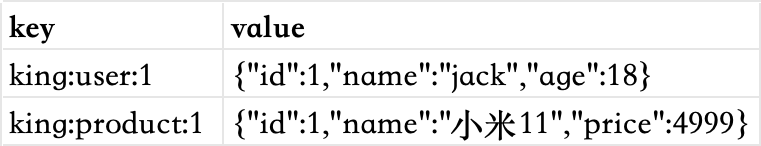
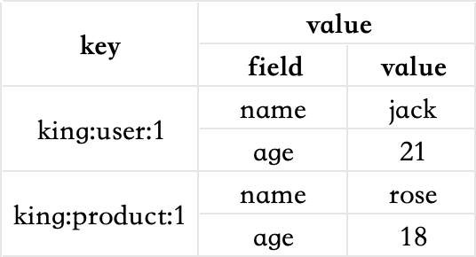
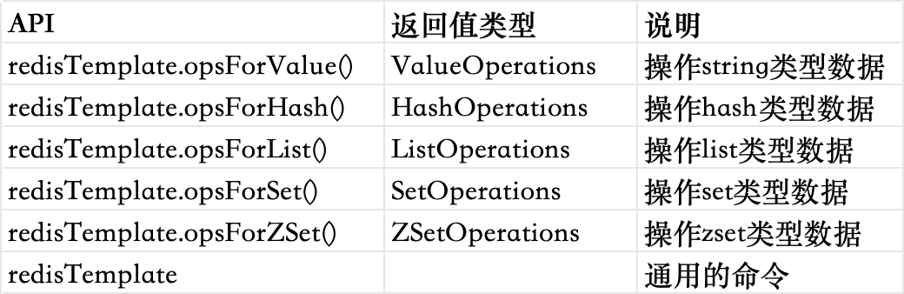
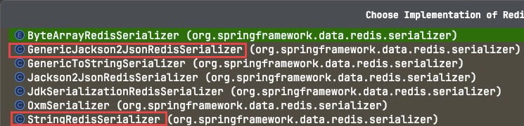

# redis的介绍

redis是一个基于内存的键值型nosql数据库。 特征：

- 键值型，value支持多种不同数据结构，功能丰富。
- 单线程，每个命令具备原子性
- 低延迟，速度快（基于内存，IO多路复用，良好的编码）
- 支持数据持久化
- 支持主从集群，分片集群
- 支持多语言客户端

redis的安装，由于本人是macos系统，所以采用的是homebrew的方式进行的安装。其他系统的安装参照网上相关的文档即可。
在启动redis服务之前，一般需要对redis的配置文件进行修改，主要修改的几个地方如下

```properties
#监听的地址，默认是127.0.0.1，只能在本地访问。一般会改成0.0.0.0，可以在任意ip地址访问。
bind 0.0.0.0
#守护进程，修改为yes可以后台启动服务
daemonize yes
#密码，根据需要进行设定
requirepass 123456
```

# 数据结构

redis是一个key-value的数据库，key一般是string类型，不过value的类型多种多样。基本的类型包含string、list、hash、set、zset，特殊类型一般常用的有geo、bitmap、hyperloglog。

# 通用命令

通用命令是部分数据类型的，都可以使用的命令，常见的有：

- keys 查看所有符合模版的key
- del 删除一个指定的key
- exists 判断一个key是否存在
- expire 给一个key设置有效期，有效期到期时该key会被自动删除
- ttl 查看一个key的剩余有效期

# string

string也就是字符串类型，是redis中最简单的存储类型。其value值是字符串，不过根据字符串的格式的不同，又可以分为3类

- string 普通字符串
- int 整数类型，可以做自增自减操作
- float 浮点类型，可以做自增自减操作

不管是哪种格式，底层都是字节数组形式存储，只不过是编码方式不同。字符串类型的最大空间不能超过512m

string的常见命令有

- set 添加或者修改已经存在的一个string类型的键值对
- get 根据key获取string类型的value
- mset 批量添加多个string类型的键值对
- mget 根据多个key获取多个string类型的value
- incr 让一个整型的key自增1
- incrby 让一个整型的key自增并指定步长，例如：incrby num 2，让num值自增2
- incrbyfloat 让一个浮点类型的数字自增并指定步长
- setnx 添加一个string类型的键值对，前提是这个key不存在，否则不执行
- setex 添加一个string类型的键值对，并且指定有效期

**【拓展】key和value的结构**

redis的key允许有多个单词形成层级结构，多个单词之间使用冒号“:”隔开，格式如下

```
项目名:业务名:类型:id
```

这个格式并非固定，可以根据自己的需求来删除或者添加词条。

例如项目是king，有user和product两种不同类型的数据，可以这样定义key

* user相关的key：king:user:1
* product相关的key：king:product:1

如果value是一个java对象，则可以将对象序列化成json字符串后存储，比如



# hash

hash类型，也叫散列，其value是一个无序字典，类似于java中的hashmap结构。

string结构是将对象序列化为json字符串后存储，当需要修改对象某个字段时很不方便。


hash结构可以将对象中的每个字段独立存储，可以针对单个字段做crud



hash的常见命令有

* hset key field value 添加或者修改hash类型key的field的值
* hget key field 获取一个hash类型key的field的值
* hmset 批量添加多个hash类型key的field的值
* hmget 批量获取多个hash类型key的field的值
* hgetall 获取一个hash类型的key中的所有的field和value
* hkeys 获取一个hash类型的key中的所有的field
* hvals 获取一个hash类型的key中的所有的value
* hincrby 让一个hash类型key的字段值自增并指定步长
* hsetnx 添加一个hash类型的key的field值，前提是这个field不存在，否则不执行

# list

redis中的list类型与java中的linkedlist类似，可以看做是一个双向链表结构。既可以支持正向检索，也可以支持反向检索。

特征也与linkedlist类似

* 有序
* 元素可以重复
* 插入和删除快
* 查询速度一般

常用来存储一个有序数据，例如朋友圈点赞列表，评论列表等。

list常见的命令有

* lpush key element ... 向列表左侧插入一个或多个元素
* lpop key 移除并返回列表左侧的第一个元素，没有则返回nil
* rpush key element ... 向列表右侧插入一个或多个元素
* rpop key 移除并返回列表右侧的第一个元素
* lrange key start end 返回一段角标范围内的所有元素
* blpop和brpop 与lpop和rpop类似，只不过在没有元素时等待指定时间，而不是直接返回nil

# set

redis的set结构与java中的hashset类似，可以看做是一个value为null的hashmap。因为也是一个hash表，因此具备与hashset类似的特征

* 无序
* 元素不可重复
* 查找快
* 支持交集、并集、差集等功能

set常见的命令有

* sadd key member ... 向set中添加一个或者多个元素
* srem key member ... 移除set中的指定元素
* scard key 返回set中元素的个数
* sismember key member 判断一个元素是否存在于set中
* smembers 获取set中的所有元素
* sinter key1 key2 求key1与key2的交集
* sdiff key1 key2 求key1与key2的差集
* sunion key1 key2 求key1与key2的并集

**set的练习**

将下列数据使用redis的set集合来存储

* 张三的好友：李四、王五、赵六
* 李四的好友：王五、麻子、二狗

我们在redis中创建set集合，如下

```shell
127.0.0.1:6379> sadd zs lisi wangwu zhaoliu
(integer) 3
127.0.0.1:6379> sadd ls wangwu mazi ergou
(integer) 3
```

求解以下问题

* 计算张三的好友有几个人

使用scard命令即可求解，如下

```shell
127.0.0.1:6379> scard zs
(integer) 3
```

* 计算张三和李四有哪些共同好友

使用sinter命令即可求解，如下

```shell
127.0.0.1:6379> sinter zs ls
1) "wangwu"
```

* 查询哪些人是张三的好友却不是李四的好友

使用sdiff命令对zs和ls进行差集计算即可，但是要注意顺序，是张三的好友但不是李四的好友，需要将zs放在前面，如下

```shell
127.0.0.1:6379> sdiff zs ls
1) "lisi"
2) "zhaoliu"
```

* 查询张三和李四的好友总共有哪些人

使用sunion命令求并集即可，如下

```shell
127.0.0.1:6379> sunion zs ls
1) "lisi"
2) "wangwu"
3) "zhaoliu"
4) "mazi"
5) "ergou"
```

* 判断李四是否是张三的好友

使用命令sismember命令查询李四是否在张三的好友列表中，如下

```shell
127.0.0.1:6379> sismember zs lisi
(integer) 1
```

* 判断张三是否是李四的好友

和上题一样，同样是使用sismember命令

```shell
127.0.0.1:6379> sismember ls zhangsan
(integer) 0
```

* 将李四从张三的好友列表中移除

使用命令srem即可，如下

```shell
127.0.0.1:6379> srem zs lisi
(integer) 1
```

# zset

redis的zset是一个可排序的set集合，与java中的treeset有些类似，但底层的数据结构却差别很大。zset中的每一个元素都带有一个score属性，可以基于score属性对元素排序，底层的实现是一个跳表（skiplist）加hash表。

zset具备下列特性

* 可排序
* 元素不重复
* 查询速度快

因为zset的可排序特性，经常被用来实现排行榜这样的功能。

zset常见的命令有

* zadd key score member 添加一个或多个元素到zset，如果已经存在则更新其score值
* zrem key member 删除zset中的一个指定元素
* zscore key member 获取zset中指定元素的score值
* zrank key member 获取zset中指定元素的排名
* zcard key 获取zset中的元素个数
* zcount key min max 统计score值在给定范围内的所有元素的个数
* zincrby key increment member 让zset中的指定元素自增，步长为指定的increment值
* zrange key min max 按照score排序后，获取指定排名范围内的元素
* zrangebyscore key min max 按照score排序后，获取指定score范围内的元素
* zdiff、zinter、zunion 求差集、交集、并集

注意：所有的排名默认都是升序，如果要降序则在命令的“z”后面添加“rev”即可。

**zset的练习**

将班级中的下列学生得分信息通过zset存入redis中，如下

jack 85,lucy 89,rose 82,tom 95,jerry 78,amy 92,miles 76

```shell
127.0.0.1:6379> zadd stu 85 jack 89 lucy 82 rose 95 tom 78 jerry 92 amy 76 miles
(integer) 7
```

求解如下功能

* 删除tom同学

使用zrem命令即可，如下

```shell
127.0.0.1:6379> zrem stu tom
(integer) 1
```

* 获取amy同学的分数

使用zscore命令即可，如下

```shell
127.0.0.1:6379> zscore stu amy
"92"
```

* 获取rose同学的排名

这里需要注意一点，默认排名是升序，如果想获取升序排名，则使用zrank命令，如果想获取降序排名，则使用zrevrank命令，如下

```shell
127.0.0.1:6379> zrank stu rose
(integer) 2
127.0.0.1:6379> zrevrank stu rose
(integer) 3
```

* 查询80分以下有几个学生

使用zcount命令即可，如下

```shell
127.0.0.1:6379> zcount stu 0 80
(integer) 2
```

* 给amy同学加2分

使用zincrby命令即可，如下

```shell
127.0.0.1:6379> zincrby stu 2 amy
"94"
```

* 查询成绩前3名的同学

首先是降序排序，然后使用zrange命令即可，如下

```shell
127.0.0.1:6379> zrevrange stu 0 2
1) "amy"
2) "lucy"
3) "jack"
```

* 查出成绩80分以下的所有同学

使用zrangebyscore命令即可，如下

```shell
127.0.0.1:6379> zrangebyscore stu 0 80
1) "miles"
2) "jerry"
```

# redis的java客户端

redis的java客户端，常用的有以下三种。

* jedis 以redis命令作为方法名称，学习成本低，简单实用。但是jedis实例是线程不安全的，多线程环境下需要基于连接池来使用。
* lettuce 基于netty实现的，支持同步，异步和响应式编程方式，并且是线程安全的。支持redis的哨兵模式，集群模式和管道模式。
* redisson 是一个基于redis实现的分布式，可伸缩的java数据结构集合。包含了诸如map、queue、lock、semaphore、atomiclong等强大功能。

## jedis

使用jedis需要先导入依赖

```shell
<dependency>
    <groupId>redis.clients</groupId>
    <artifactId>jedis</artifactId>
    <version>5.1.2</version>
</dependency>
```

实现一段简单的测试代码

```java
package redis;

import redis.clients.jedis.Jedis;

/**
 * @Author: Spring
 * @Description:
 * @Date: Created on 21:04 2024/3/17
 */
public class JedisTest {
    private static Jedis jedis;
    public static void main(String[] args) {
        //建立连接
        jedis = new Jedis("localhost", 6379);
        //设置密码
        jedis.auth("123456");
        //选择库
        jedis.select(0);
        //插入数据
        jedis.set("name", "张三");
        //获取数据
        System.out.println(jedis.get("name"));
        //关闭连接
        jedis.close();
    }
}

```

jedis本身是线程不安全的，并且频繁的创建和销毁连接会有性能损耗，因此更推荐使用jedis连接池来替代jedis的直连方式。

下面是一段jedis连接池的示例代码

```java
package redis;

import redis.clients.jedis.Jedis;
import redis.clients.jedis.JedisPool;
import redis.clients.jedis.JedisPoolConfig;

/**
 * @Author: Spring
 * @Description:
 * @Date: Created on 21:29 2024/3/17
 */
public class JedisPoolTest {
    private static final JedisPool jedisPool;
    static {
        //配置连接池
        JedisPoolConfig config = new JedisPoolConfig();
        //最大连接
        config.setMaxTotal(8);
        //最大空闲连接
        config.setMaxIdle(8);
        //最小空闲连接
        config.setMinIdle(0);
        //最大等待时间
        config.setMaxWaitMillis(5000);
        jedisPool = new JedisPool(config, "localhost", 6379, 1000, "123456");
    }
    public static void main(String[] args) {
        //从连接池中获取一个jedis连接
        Jedis jedis = jedisPool.getResource();
        //选择库
        jedis.select(0);
        //插入数据
        jedis.hset("person", "name", "李四");
        jedis.hset("person", "age", "18");
        //关闭连接（归还连接到连接池）
        jedis.close();
    }
}

```

## spring data redis

springdata是spring中数据操作的模块，包含对各种数据库的集成，其中对redis的集成模块就叫做spring data redis

* 提供了对不同redis客户端的整合（lettuce和jedis）
* 提供了redisTemplate统一api来操作redis
* 支持redis的发布订阅模型
* 支持redis哨兵和redis集群
* 支持基于lettuce的响应式编程
* 支持基于jdk、json、字符串、spring对象的数据序列化和反序列化
* 支持基于redis的jdk collection实现

spring data redis中提供了redisTemplate工具类，其中封装了各种对redis的操作。并且将不同数据类型的操作api封装到了不同的类型中



若要使用spring data redis，必须先引入依赖如下

```xml
<dependency>
    <groupId>org.springframework.boot</groupId>
    <artifactId>spring-boot-starter-data-redis</artifactId>
    <version>2.4.1</version>
</dependency>
```

```xml
<dependency>
    <groupId>org.apache.commons</groupId>
    <artifactId>commons-pool2</artifactId>
    <version>2.11.1</version>
</dependency>
```

然后在springboot工程的yaml配置文件中编辑连接信息

```yaml
spring:
  redis:
    host: localhost
    port: 6379
    password: 123456
    lettuce:
      pool:
        max-active: 8 # 最大连接
        max-wait: 100 # 连接等待时间
        max-idle: 8 # 最大空闲连接
        min-idle: 0 # 最小空闲连接
```

然后编写服务类，注入redisTemplate，进行使用，样例代码如下

```java
package redis;

import org.springframework.beans.factory.annotation.Autowired;
import org.springframework.data.redis.core.RedisTemplate;
import org.springframework.stereotype.Service;

import javax.annotation.PostConstruct;

/**
 * @Author: Spring
 * @Description:
 * @Date: Created on 22:44 2024/3/17
 */
@Service
public class SpingDataRedisTest {
    //自动装配 RedisTemplate
    @Autowired
    private RedisTemplate redisTemplate;

    @PostConstruct
    public void init() {
        //插入一条string类型数据
        redisTemplate.opsForValue().set("name", "spring");
        //对数据进行读取
        Object name = redisTemplate.opsForValue().get("name");
        System.out.println(name);
    }
}

```

但是上面的代码，在运行之后，是有问题的。那就是我们存入到redis中的key，本应该是name，value本应该是spring，但是却出现了如下的情况

```shell
127.0.0.1:6379> keys * 
1) "\xac\xed\x00\x05t\x00\x04name"
127.0.0.1:6379> get "\xac\xed\x00\x05t\x00\x04name"
"\xac\xed\x00\x05t\x00\x06spring"
```

数据的编码出现了问题，问题的根本原因出在序列化上。

redisTemplate可以接收任意object作为值写入redis，只不过写入前会把object序列化成字节形式，默认是采用jdk序列化（JdkSerializationRedisSerializer），而这种序列化方式的缺点很明显

* 可读性差
* 内存占用较大

redisTemplate的key和value的序列化器RedisSerializer，有以下几种实现



key通常采用的是StringRedisSerializer，而value通常采用的是GenericJackson2JsonRedisSerializer，所以需要我们在代码中进行指定。

下面是一段自定义redisTemplate的序列化器的代码，如下

```java
package redis;

import org.springframework.context.annotation.Bean;
import org.springframework.context.annotation.Configuration;
import org.springframework.data.redis.connection.RedisConnectionFactory;
import org.springframework.data.redis.core.RedisTemplate;
import org.springframework.data.redis.serializer.GenericJackson2JsonRedisSerializer;
import org.springframework.data.redis.serializer.RedisSerializer;

/**
 * @Author: Spring
 * @Description:
 * @Date: Created on 01:37 2024/3/18
 */
@Configuration
public class RedisConfig {
    @Bean
    public RedisTemplate<String, Object> redisTemplate(RedisConnectionFactory factory) {
        //创建 RedisTemplate
        RedisTemplate<String, Object> template = new RedisTemplate<>();
        //设置连接工厂
        template.setConnectionFactory(factory);
        //设置序列化器
        GenericJackson2JsonRedisSerializer jsonRedisSerializer = new GenericJackson2JsonRedisSerializer();
        //设置key的序列化器
        template.setKeySerializer(RedisSerializer.string());
        template.setHashKeySerializer(RedisSerializer.string());
        //设置value的序列化器
        template.setValueSerializer(jsonRedisSerializer);
        template.setHashValueSerializer(jsonRedisSerializer);
        //返回
        return template;
    }
}

```

然后修改一下我们的服务类中RedisTemplate的泛型即可。如下

```java
//自动装配 RedisTemplate
@Autowired
private RedisTemplate<String, Object> redisTemplate;
```

因为我们在代码中显式的使用@Bean声明了一个RedisTemplate，所以在使用时，通过@Autowired引入的就是我们声明的带有序列化器的那个。

再次运行代码显示结果正常。

我们也可以往redis中存入java对象。首先创建一个User类型的对象如下

```java
package redis;

import lombok.AllArgsConstructor;
import lombok.Data;
import lombok.NoArgsConstructor;

/**
 * @Author: Spring
 * @Description:
 * @Date: Created on 01:50 2024/3/18
 */
@Data
@NoArgsConstructor
@AllArgsConstructor
public class User {
    private String name;
    private int age;
}

```

然后编写我们的服务类如下

```java
package redis;

import org.springframework.beans.factory.annotation.Autowired;
import org.springframework.data.redis.core.RedisTemplate;
import org.springframework.stereotype.Service;

import javax.annotation.PostConstruct;

/**
 * @Author: Spring
 * @Description:
 * @Date: Created on 22:44 2024/3/17
 */
@Service
public class SpingDataRedisTest {
    //自动装配 RedisTemplate
    @Autowired
    private RedisTemplate<String, Object> redisTemplate;

    @PostConstruct
    public void init() {
        //插入一条user类型数据
        redisTemplate.opsForValue().set("user", new User("周杰伦", 50));
        //对数据进行读取
        User user = (User) redisTemplate.opsForValue().get("user");
        System.out.println(user);
    }
}

```

验证结果正常

```json
{"@class":"redis.User","name":"周杰伦","age":50}
```

虽然对value采用json的序列化方式可以满足我们的需求，但依然存在一些问题，就拿上面存入User类型对象来说，除了对象的私有属性外，还额外的存储了对象的class类型。

为了在反序列化时知道对象的类型，json序列化器会将类的class信息写入到json结果中，会带来额外的内存开销。

为了节省内存空间，我们并不会使用json序列化器来处理value，而是统一使用string序列化器，要求只能存储string类型的key和value。当需要存储java对象时，手动完成对象的序列化和反序列化。

spring默认提供了一个StringRedisTemplate类，它的key和value的序列化方式默认就是string方式。省去了我们自定义RedisTemplate的过程。

下面的代码举例说明了该如何进行使用

```java
package redis;

import org.codehaus.jackson.map.ObjectMapper;
import org.springframework.beans.factory.annotation.Autowired;
import org.springframework.data.redis.core.StringRedisTemplate;
import org.springframework.stereotype.Service;

import javax.annotation.PostConstruct;
import java.io.IOException;

/**
 * @Author: Spring
 * @Description:
 * @Date: Created on 22:44 2024/3/17
 */
@Service
public class SpingDataRedisTest {
    private static final ObjectMapper MAPPER = new ObjectMapper();
    //自动装配 RedisTemplate
    @Autowired
    private StringRedisTemplate redisTemplate;

    @PostConstruct
    public void init() throws IOException {
        //准备user对象
        User user = new User("蔡依林", 45);
        //手动进行序列化
        String data = MAPPER.writeValueAsString(user);
        //写入数据
        redisTemplate.opsForValue().set("cyl", data);
        //对数据进行读取
        String result = redisTemplate.opsForValue().get("cyl");
        //手动进行反序列化
        User userResult = MAPPER.readValue(result, User.class);
        System.out.println(userResult);
    }
}

```

存入的数据结果也是正常的，而且没有了class类型。

```json
{"name":"蔡依林","age":45}
```