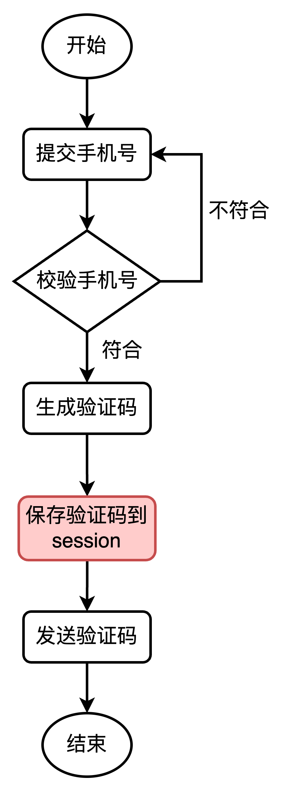
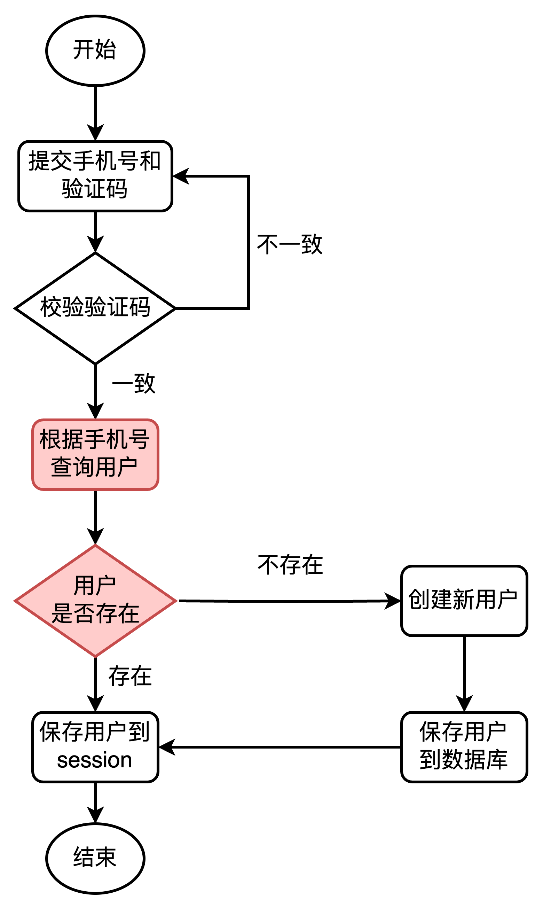
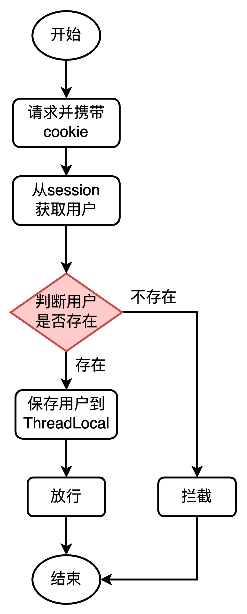

# redis企业实战

## 短信登录

首先是准备一些基础数据，在工程的file目录下有一份hmdp.sql文件，运行该sql文件可以将数据准备到mysql中。

这份文件中主要包含以下这些表

* tb_user 用户表
* tb_user_info 用户详情表
* tb_shop 商户信息表
* tb_shop_type 商户类型表
* tb_blog 用户日记表（达人探店日记）
* tb_follow 用户关注表
* tb_voucher 优惠券表
* tb_voucher_order 优惠券的订单表

然后在工程的file目录下还有一个hm-dianping.zip压缩文件，解压缩之后，将该工程导入到idea中，并进行整理。

首先就是下载依赖，需要将pom文件中的依赖全部下载下来，接下来需要修改工程中resources目录下的application.yaml文件。文件中关于mysql和redis的连接配置，需要根据个人的安装环境，修改对应的信息。比如我这里修改如下

```yaml
spring:
  application:
    name: hmdp
  datasource:
    driver-class-name: com.mysql.jdbc.Driver
    url: jdbc:mysql://localhost:3306/wcq?useSSL=false&serverTimezone=UTC
    username: root
    password: 12345678
  redis:
    host: localhost
    port: 6379
    password: 123456
    lettuce:
      pool:
        max-active: 10
        max-idle: 10
        min-idle: 1
        time-between-eviction-runs: 10s
```

主要是修改连接地址，数据库名称，用户名和密码等信息。

接下来就是找到工程中的HmDianPingApplication类，启动springboot应用程序。应用程序启动成功之后，访问 http://localhost:8081/shop-type/list ，如果可以看到数据则证明运行没有问题。

再接下来就是要部署前端的项目，在file目录下有一个nginx-1.18.0.zip压缩文件，将其进行解压，然后将文件夹放入到一个没有中文和特殊字符的目录下，然后直接启动目录下的nginx.exe即可。启动之后可访问 http://localhost:8080 进行查看。

### 基于session实现登录

基于session实现登录的功能主要涉及到以下几部分，第一个就是发送短信验证码，如下



第二个就是短信验证码登录、注册，如下



第三个就是校验登录状态，如下



首先来实现发送短信验证码的功能。