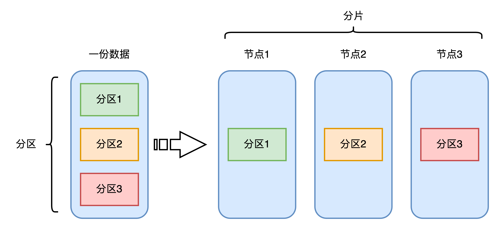
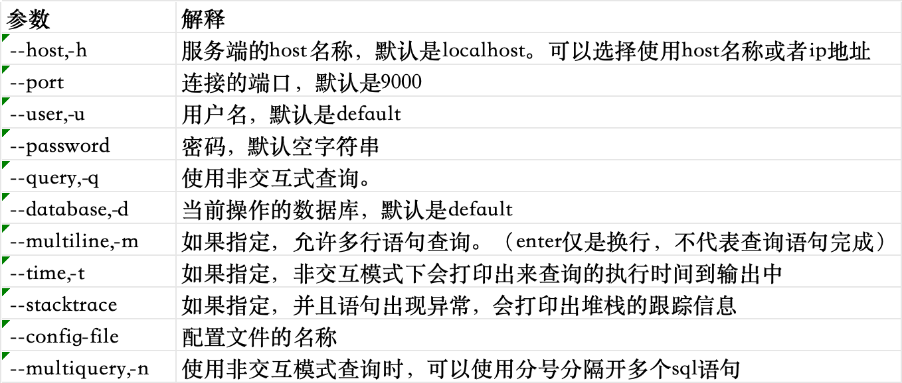
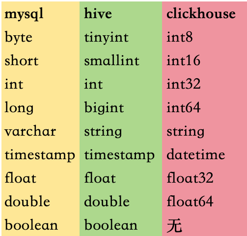
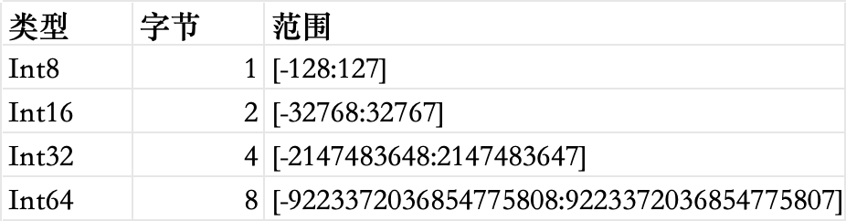
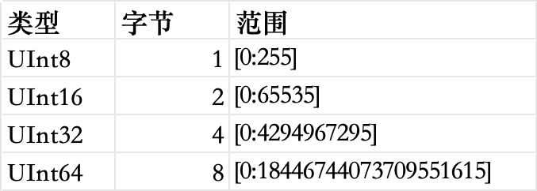
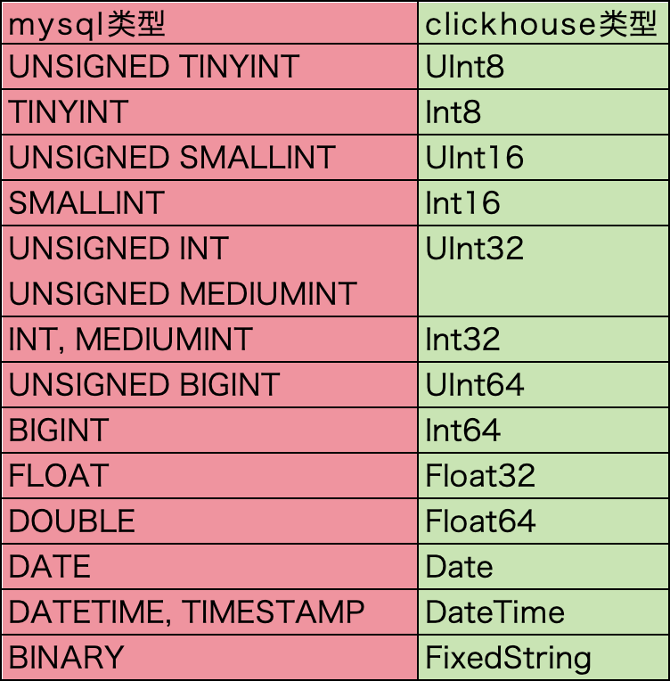

# clickhouse简介

ClickHouse是一个开源的，用于olap分析的列式数据库管理系统。它是面向列的，并允许使用sql查询，实时生成分析报告。

## 特性

### 完备的dbms功能

ClickHouse是一个数据库管理系统，而不仅仅是一个数据库，作为数据库管理系统具备完备的管理功能：

* ddl：可以动态的创建，修改或删除数据库，表和视图，而无需重启服务。
* dml：可以动态查询，插入，修改或删除数据。
* 分布式管理：提供集群模式，能够自动管理多个数据库节点。
* 权限控制：可以按照用户粒度设置数据库或者表的操作权限，保障数据的安全性。
* 数据备份与恢复：提供了数据备份导出与导入恢复机制，满足生产环境的要求。

### 列式存储

目前大数据存储有两种方案可以选择，行式存储和列式存储。

行式存储在数据写入和修改上具有优势。

列式存储在数据读取和解析，分析数据上具有优势。

### 数据压缩

为了使数据在传输上更小，处理起来更快，可以对数据进行压缩，ClickHouse默认只使用lz4算法压缩，数据总体压缩比可达8:1

### 向量化执行引擎

何为向量化执行？向量化执行，可以简单的看做是一项消除程序中循环的优化。这里举个形象的例子。

一家水果店，榨橙汁，生产一杯橙汁需要5分钟的时间。有一天同时来了8个顾客，每人都要一杯。售货员就开始做，因为只有一个榨汁机，所以做完这8杯橙汁一共花了40分钟的时间。后来店铺升级了，榨汁机的数量从一台增加到了8台。有一天又同时来了8个顾客，每人都要一杯橙汁，此时8台机器同时运作，最终只花了5分钟的时间就完成了。

为了制作n杯果汁，非向量化的执行方式是用1台机器重复循环执行n次，而向量化的执行方式是用n台机器只执行一次。

ClickHouse使用sse4.2指令集实现向量化执行，为处理数据提升很大效率。

### 关系模型与标准sql查询

相比hbase和redis这类nosql数据库，ClickHouse使用关系模型描述数据并提供了传统数据库的概念（数据库，表，视图和函数等）。ClickHouse完全使用sql作为查询语言（支持group by，order by，join，in等大部分标准sql），ClickHouse提供了标准协议的sql查询接口，可以与第三方分析可视化系统无缝集成对接。在sql解析方面，ClickHouse大小写敏感。

### 多样化的表引擎

与mysql类似，ClickHouse也将存储部分进行了抽象，把存储引擎作为一层独立的接口。ClickHouse拥有各种表引擎，每种表引擎决定不同的数据存储方式。其中每一种表引擎都有着各自的特点，用户可以根据实际业务场景的要求，选择合适的表引擎来使用。将表引擎独立设计的好处是通过特定的表引擎支撑特定的场景，十分灵活，对于简单的场景，可直接使用简单的引擎降低成本，而复杂的场景也有合适的选择。

### 多线程与分布式

向量化执行是通过数据级并行的方式提升了性能，多线程处理是通过线程级并行的方式实现了性能的提升。相比基于底层硬件实现的向量化执行simd，线程级并行通常由更高层次的软件层面控制，目前市面上的服务器都支持多核心多线程处理能力。由于simd不适合用于带有较多分支判断的场景，ClickHouse也大量使用了多线程技术以实现提速，以此和向量化执行形成互补。ClickHouse在数据存取方面，既支持分区（纵向扩展，利用多线程原理），也支持分片（横向扩展，利用分布式原理），可以说是将多线程和分布式的技术应用到了极致。



### 多主架构

hdfs，spark，hbase和es这类分布式系统，都采用了master-slave主从架构，由一个管控节点作为leader统筹全局。而ClickHouse则采用multi-master多主架构，集群中的每个节点角色对等，客户端访问任意一个节点都能得到相同的效果。这种多主的架构有许多优势，例如对等的角色使系统架构变得更加简单，不用再区分主控节点，数据节点和计算节点，集群中的所有节点功能相同。所以它天然的规避了单点故障的问题，非常适合用于多数据中心，异地多活的场景。

### 交互式查询

hive，sparksql，hbase等都支持海量数据的查询场景，都拥有分布式架构，都支持列存，数据分片，计算下推等特性。ClickHouse在设计上吸取了以上技术的优势。例如，hive，sparksql无法保证90%以上的查询在秒级内响应，在大数据量复杂查询下需要至少分钟级的响应时间，而hbase可以对海量数据做到交互式查询，由于不支持标准sql在对数据做olap聚合分析时显得力不从心。ClickHouse吸取以上各个技术的优势，在复杂查询的场景下，也能做到极快的响应，且无须对数据进行任何预处理加工。

### 数据分片与分布式查询

数据分片是将数据进行横向切分，这是一种在面对海量数据的场景下，解决存储和查询瓶颈的有效手段，是一种分治思想的体现。ClickHouse支持分片，而分片则依赖集群。每个集群由1到多个分片组成，而每个分片则对应了ClickHouse的1个服务节点。分片的数量上限取决于节点数量（1个分片只能对应1个服务节点）。

ClickHouse拥有高度自动化的分片功能。ClickHouse提供了本地表（LocalTable）与分布式表（DistributedTable）的概念。一张本地表等同于一份数据的分片。而分布式表本身不存储任何数据，它是本地表的访问代理，其作用类似于分库中间件。借助分布式表，能够代理访问多个数据分片，从而实现分布式查询。

这种设计类似数据库的分库分表，十分灵活。例如在业务系统上线初期，数据体量不大，此时数据表并不需要多个分片，所以使用单个节点的本地表（单个数据分片）即可，待到业务增长，数据量很大的时候，再通过增加数据分片的方式分流数据，并通过分布式表实现分布式查询。

# clickhouse安装

因为本人使用的是macos系统，所以下面的安装和启动步骤是基于macos系统的。其他系统的安装和启动步骤请参考官方文档 https://clickhouse.com/docs/en/install

首先运行下面的命令下载二进制文件，如下

```shell
➜  ~ curl https://clickhouse.com/ | sh
  % Total    % Received % Xferd  Average Speed   Time    Time     Time  Current
                                 Dload  Upload   Total   Spent    Left  Speed
100  2822    0  2822    0     0   3122      0 --:--:-- --:--:-- --:--:--  3121

Will download https://builds.clickhouse.com/master/macos/clickhouse into clickhouse

  % Total    % Received % Xferd  Average Speed   Time    Time     Time  Current
                                 Dload  Upload   Total   Spent    Left  Speed
100 74.0M  100 74.0M    0     0  8919k      0  0:00:08  0:00:08 --:--:-- 11.2M

Successfully downloaded the ClickHouse binary, you can run it as:
    ./clickhouse
```

然后启动clickhouse的服务，--daemon代表是后台启动，命令如下

```shell
➜  ~ ./clickhouse server --daemon
```

然后启动客户端进行连接即可。

```shell
➜  ~ ./clickhouse client
ClickHouse client version 24.3.1.1588 (official build).
Connecting to localhost:9000 as user default.
Connected to ClickHouse server version 24.3.1.

Warnings:
 * Maximum number of threads is lower than 30000. There could be problems with handling a lot of simultaneous queries.

kingdemacbook-pro.local :)
```

至此，clickhouse单节点的安装方式就完成了。如果想实现分布式的安装，可以参考官方文档，这里先不做过多的介绍。

# clickhouse客户端命令行参数

通过clickhouse client来连接启动的clickhouse服务。连接服务时，可以指定以下参数。这里指定的参数会覆盖默认值和配置文件中的值。



# 数据类型

clickhouse提供了许多的数据类型，它们可以划分为基础类型，复合类型，以及特殊类型。可以在system库下的data_type_families表中查看数据类型名称以及是否区分大小写。这个表中存储了clickhouse支持的所有数据类型。如下

```sql
kingdemacbook-pro.local :) select * from data_type_families;

SELECT *
FROM data_type_families

Query id: cde8701b-c787-4b4d-a43a-b3d4816422c5

┌─name────────────────────────────┬─case_insensitive─┬─alias_to────┐
│ JSON                            │                1 │             │
│ Polygon                         │                0 │             │
│ Ring                            │                0 │             │
│ Point                           │                0 │             │
│ SimpleAggregateFunction         │                0 │             │
│ IntervalQuarter                 │                0 │             │
│ IntervalMonth                   │                0 │             │
│ Int64                           │                0 │             │
│ IntervalDay                     │                0 │             │
│ IntervalHour                    │                0 │             │
│ IPv4                            │                0 │             │
│ IntervalSecond                  │                0 │             │
│ LowCardinality                  │                0 │             │
│ Int16                           │                0 │             │
│ UInt256                         │                0 │             │
│ AggregateFunction               │                0 │             │
│ MultiPolygon                    │                0 │             │
│ IPv6                            │                0 │             │
│ Nothing                         │                0 │             │
│ Decimal256                      │                1 │             │
│ Tuple                           │                0 │             │
│ Array                           │                0 │             │
│ IntervalMicrosecond             │                0 │             │
│ Bool                            │                1 │             │
| Enum16                          │                0 │             │
│ IntervalMinute                  │                0 │             │
│ FixedString                     │                0 │             │
│ String                          │                0 │             │
│ DateTime                        │                1 │             │
│ Object                          │                0 │             │
│ Map                             │                0 │             │
│ UUID                            │                0 │             │
│ Decimal64                       │                1 │             │
│ Nullable                        │                0 │             │
│ Enum                            │                1 │             │
│ Int32                           │                0 │             │
│ UInt8                           │                0 │             │
│ Date                            │                1 │             │
│ Decimal32                       │                1 │             │
│ UInt128                         │                0 │             │
│ Variant                         │                0 │             │
│ Float64                         │                0 │             │
│ Nested                          │                0 │             │
│ UInt16                          │                0 │             │
│ IntervalMillisecond             │                0 │             │
│ Int128                          │                0 │             │
│ Decimal128                      │                1 │             │
│ Int8                            │                0 │             │
│ Decimal                         │                1 │             │
│ Int256                          │                0 │             │
│ DateTime64                      │                1 │             │
│ Enum8                           │                0 │             │
│ DateTime32                      │                1 │             │
│ Date32                          │                1 │             │
│ IntervalWeek                    │                0 │             │
│ UInt64                          │                0 │             │
│ IntervalNanosecond              │                0 │             │
│ IntervalYear                    │                0 │             │
│ UInt32                          │                0 │             │
│ Float32                         │                0 │             │
│ bool                            │                1 │ Bool        │
│ INET6                           │                1 │ IPv6        │
│ INET4                           │                1 │ IPv4        │
│ ENUM                            │                1 │ Enum        │
│ BINARY                          │                1 │ FixedString │
│ GEOMETRY                        │                1 │ String      │
│ NATIONAL CHAR VARYING           │                1 │ String      │
│ BINARY VARYING                  │                1 │ String      │
│ NCHAR LARGE OBJECT              │                1 │ String      │
│ NATIONAL CHARACTER VARYING      │                1 │ String      │
│ boolean                         │                1 │ Bool        │
│ NATIONAL CHARACTER LARGE OBJECT │                1 │ String      │
│ NATIONAL CHARACTER              │                1 │ String      │
│ NATIONAL CHAR                   │                1 │ String      │
│ CHARACTER VARYING               │                1 │ String      │
│ LONGBLOB                        │                1 │ String      │
│ TINYBLOB                        │                1 │ String      │
│ CLOB                            │                1 │ String      │
│ BLOB                            │                1 │ String      │
│ MEDIUMTEXT                      │                1 │ String      │
│ TEXT                            │                1 │ String      │
│ VARCHAR2                        │                1 │ String      │
│ CHARACTER LARGE OBJECT          │                1 │ String      │
│ DOUBLE PRECISION                │                1 │ Float64     │
│ LONGTEXT                        │                1 │ String      │
│ NVARCHAR                        │                1 │ String      │
│ INT1 UNSIGNED                   │                1 │ UInt8       │
│ VARCHAR                         │                1 │ String      │
│ CHAR VARYING                    │                1 │ String      │
│ MEDIUMBLOB                      │                1 │ String      │
│ NCHAR                           │                1 │ String      │
│ VARBINARY                       │                1 │ String      │
│ CHAR                            │                1 │ String      │
│ SMALLINT UNSIGNED               │                1 │ UInt16      │
│ TIMESTAMP                       │                1 │ DateTime    │
│ FIXED                           │                1 │ Decimal     │
│ TINYTEXT                        │                1 │ String      │
│ NUMERIC                         │                1 │ Decimal     │
│ DEC                             │                1 │ Decimal     │
│ DOUBLE                          │                1 │ Float64     │
│ BYTEA                           │                1 │ String      │
│ INT                             │                1 │ Int32       │
│ SINGLE                          │                1 │ Float32     │
│ BIT                             │                1 │ UInt64      │
│ BIGINT UNSIGNED                 │                1 │ UInt64      │
│ UNSIGNED                        │                1 │ UInt64      │
│ TINYINT UNSIGNED                │                1 │ UInt8       │
│ INTEGER UNSIGNED                │                1 │ UInt32      │
│ INT UNSIGNED                    │                1 │ UInt32      │
│ REAL                            │                1 │ Float32     │
│ CHARACTER                       │                1 │ String      │
│ BYTE                            │                1 │ Int8        │
│ SIGNED                          │                1 │ Int64       │
│ MEDIUMINT                       │                1 │ Int32       │
│ YEAR                            │                1 │ UInt16      │
│ CHAR LARGE OBJECT               │                1 │ String      │
│ TINYINT                         │                1 │ Int8        │
│ BIGINT                          │                1 │ Int64       │
│ SMALLINT                        │                1 │ Int16       │
│ INTEGER SIGNED                  │                1 │ Int32       │
│ NCHAR VARYING                   │                1 │ String      │
│ INT SIGNED                      │                1 │ Int32       │
│ BIGINT SIGNED                   │                1 │ Int64       │
│ BINARY LARGE OBJECT             │                1 │ String      │
│ SMALLINT SIGNED                 │                1 │ Int16       │
│ FLOAT                           │                1 │ Float32     │
│ SET                             │                1 │ UInt64      │
│ TIME                            │                1 │ Int64       │
│ MEDIUMINT SIGNED                │                1 │ Int32       │
│ INT1 SIGNED                     │                1 │ Int8        │
│ INTEGER                         │                1 │ Int32       │
│ MEDIUMINT UNSIGNED              │                1 │ UInt32      │
│ INT1                            │                1 │ Int8        │
│ TINYINT SIGNED                  │                1 │ Int8        │
└─────────────────────────────────┴──────────────────┴─────────────┘

134 rows in set. Elapsed: 0.008 sec. 
```

下面将clickhouse，mysql和hive中的常见数据类型做一个对比如下



## int类型

clickhouse中整型分为int8，int16，int32，int64来表示整数不同的取值范围，其末尾数字正好代表占用字节的大小（8位=1字节），整形又包含有符号整形和无符号整形，他们在写法上的区别为无符号整形前面加“U”表示。

有符号整形范围如下



无符号整形范围如下



## float类型

建议使用整数方式来存储数据，因为浮点类型数据计算可能会导致四舍五入的误差。浮点类型包含单精度浮点数和双精度浮点数。

单精度浮点数和双精度浮点数如下


Float32从小数点后第8位起会发生数据溢出，会四舍五入。

Float64从小数点后第17位起会发生数据溢出，会四舍五入。

## decimal类型

有符号的定点数，可在加，减和乘法运算过程中保持精度。clickhouse提供了Decimal32，Decimal64，Decimal128，Decimal256几种精度的定点数，支持几种写法如下

* Decimal(P,S)
* Decimal32(S)，也可写成 Decimal(9,S)
* Decimal64(S)，也可写成 Decimal(18,S)
* Decimal128(S)，也可写成 Decimal(38,S)
* Decimal256(S)，也可写成 Decimal(76,S)

其中，p代表精度，决定总位数（整数部分+小数部分），取值范围是1~76。s代表规模，决定小数位数，取值范围是0~p

另外，Decimal数据在进行四则运算时，精度（总位数）和规模（小数位数）会发生变化，具体规则如下

* 精度（总位数）规则，运算结果总精度以参与运算的数据中最大精度为准。
* 规模（小数位数）规则
  * 加法和减法：以两个数据中小数点位数最多的为准。
  * 乘法：以两个数据的小数位相加为准。
  * 除法：以被除数的小数位为准。两数相除，被除数的小数位数不能小于除数的小数位数。

## string类型

字符串可以是任意长度的，它可以包含任意的字节集，包含空字节。因此，字符串类型可以代替其他关系型数据库中的varchar，blob，clob等类型。

## fixedString类型

固定长度n的字符串（n必须是严格的正自然数），一般在明确字符串长度的场景下使用，可以使用下面的语法对列声明为FixedString类型

```sql
-- n表示字符串的长度
<column_name> FixedString(n)
```

当向clickhouse中插入数据时，如果字符串包含的字节数少于n，将对字符串末尾进行空字节填充。如果字符串包含的字节数大于n，将抛出异常。

当做数据查询时，clickhouse不会删除字符串末尾的空字节。如果使用where子句，则需要手动添加空字节以匹配FixedString的值，新版本后期不需要手动添加。

## uuid类型

uuid是一种数据库常见的主键类型，在clickhouse中直接把它作为一种数据类型。uuid共有32位，如果在插入新纪录时未指定uuid，则uuid值将用0来填充。

uuid类型不支持算术运算，聚合函数sum和avg

## date类型

date只能精确到天，用两个字节存储，表示从1970-01-01（无符号）到当前的日期值。日期中没有存储时区信息，不能指定时区。

## datetime类型

datetime精确到秒，可以指定时区。用四个字节（无符号的）存储unix时间戳。允许存储与日期类型相同的范围内的值。最小值为0000-00-00 00:00:00，时间戳类型值精确到秒。

时区使用启动客户端或服务器时的系统时区。默认情况下，客户端连接到服务的时候会使用服务端时区。您可以通过启用客户端命令行选项--use_client_time_zone来设置使用客户端时区。

## datetime64类型

datetime64精确到毫秒和微秒，可以指定时区。在内部，此类型以int64类型将数据存储。时间刻度的分辨率由precision参数确定。此外，datetime64类型可以像存储其他数据列一样存储时区信息，时区会影响datetime64类型的值如何以文本格式显示，以及如何解析以字符串形式指定的时间数据。时区信息不存储在表的行中，而是存储在列的元数据中。语法如下

```sql
-- precision精度，timezone时区
DateTime64(precision,[timezone])
```

## 布尔类型

clickhouse中没有单独的类型来存储布尔值。可以使用UInt8类型，取值限制为0或者1

## enum枚举类型

枚举类型通常在定义常量时使用，clickhouse提供了Enum8和Enum16两种枚举类型。Enum保存string和int的对应关系。在clickhouse中，尽管用户使用的是字符串常量，但所有含有Enum数据类型的操作都是按照包含整数的值来执行。这在性能方面比使用string数据类型更有效。

Enum8和Enum16的字符串所映射的整数分别对应Int8和Int16，Enum8类型的每个值范围是【-128，127】，Enum16类型的每个值范围是【-32768，32767】，所有的字符串或者数字都必须是不一样的，允许存在空字符串，Enum类型中数字可以是任意顺序，顺序并不重要。

向Enum字段中插入值时，可以插入枚举的字符串值也可以插入枚举对应的Int值，建议插入对应的字符串值，这样避免插入对应的Int值不存在而导致查询报错。因为定义了枚举类型值之后，不能写入其他值的数据，写入的值不在枚举集合中就会抛出异常。

## nullable类型

Nullable类型只能与基础数据类型搭配使用，表示某个类型的值可以为Null，Nullable(Int8)表示可以存储Int8类型的值，没有值时存Null。使用Nullable需要注意，Nullable类型的字段不能作为索引字段，尽量避免使用Nullable类型，因为字段被定义为Nullable类型后会额外生成[Column].null.bin文件保存null值，增加开销，比普通列消耗更多的存储空间。

## array类型

Array[T]，由T类型元素组成的数组。T可以是任意类型，包含数组类型。但不推荐使用多维数组，clickhouse对多维数组的支持有限。比如，不能在MergeTree表中存储多维数组。

数组的定义方式有两种。Array[T]，还有[1,2,3,4,5...]，数组类型里面的元素必须具有相同的数据类型，否则会报异常。另外，需要注意的是，数组元素中如果存在Null值，则元素类型将变成Nullable。

从数组中查询获取值使用xx[1|2...]，直接使用中括号获取值，要注意的是下标是从1开始的。

## tuple类型

元组类型有1~n个元素组成，每个元素允许设置不同的数据类型，且彼此之间不要求兼容。与数组类似，元组也可以使用两种方式定义，tuple(1,'hello',12.34)，或者直接写(1,'hello',12.34)，元组中可以存储多种数据类型，但是要注意数据类型的顺序。

## nested类型

clickhouse支持嵌套数据类型，可以为一个表定义一个或者多个嵌套数据类型字段，但是每个嵌套字段只支持一级嵌套，即嵌套字段内不能继续使用嵌套类型。嵌套一般用来表示简单的级联关系，嵌套本质上是一个多维数组，嵌套类型中的每个数组的长度必须相同。目前，nested类型支持有限，MergeTree引擎中不支持nested类型。

## domain类型

Domain类型是特定实现的类型，目前支持IPv4和IPv6两类，本质上他们是对整形和字符串的进一步封装，IPv4类型基于UInt32封装，IPv6基于FixedString(16)封装。

出于便捷性的考量，IPv4类型支持格式检查，格式错误的IP无法被写入。出于性能的考虑，IPv4和IPv6相对于string更加紧凑，占用的空间更小，查询性能更快。

在使用domain时需要注意，虽然表面看起来与string一样，但是domain类型并不是字符串，也不支持隐式自动转换成字符串，如果需要返回IP的字符串形式，需要调用函数IPv4NumToString()和IPv6NumToString()显式实现。

# 数据库引擎

clickhouse中支持在创建数据库时指定引擎，目前比较常用的两种引擎是默认引擎和MySQL引擎。

## Ordinary默认引擎

ordinary就是clickhouse中默认引擎，如果不指定数据库引擎创建的就是ordinary数据库引擎，在这种数据库下面可以使用任意表引擎。创建时需要注意，ordinary首字母要大写，不然会抛出异常。

## MySQL引擎

mysql引擎用于将远程的mysql服务器中的表映射到clickhouse中，并允许对表进行insert插入和select查询，方便在clickhouse与mysql之间进行数据交换。这里不会将mysql的数据同步到clickhouse中，clickhouse就像一个壳子，可以将mysql的表映射成clickhouse表，使用clickhouse查询mysql中的数据，在mysql中进行的crud操作，可以同时映射到clickhouse中。

mysql数据库引擎会将对其的查询转换为mysql语法并发送到mysql服务器中，因此可以执行诸如show tables之类的操作，但是不允许创建表，修改表，删除表，删除数据，更新数据等操作。

在clickhouse中，创建mysql引擎表的语句如下

```sql
create database [if not exists] db_name [on cluster cluster_name]
       engine = MySQL('host:port','database','user','password')
```

以上语句中的参数解释如下

* host:port mysql的连接地址和端口号
* database 要连接的mysql数据库名称
* user mysql连接的用户名
* password mysql连接的密码

在clickhouse中使用mysql引擎建库，将mysql库中的数据映射到clickhouse中，mysql库中表字段类型与clickhouse表字段类型的映射如下，这里每种类型在clickhouse中都支持Nullable，即可空。



下面举例说明mysql引擎建库

首先，mysql中有一个数据库wcq，下面有很多的表，如下

```sql
mysql> use wcq;
Reading table information for completion of table and column names
You can turn off this feature to get a quicker startup with -A

Database changed
mysql> show tables;
+--------------------+
| Tables_in_wcq      |
+--------------------+
| tb_blog            |
| tb_blog_comments   |
| tb_follow          |
| tb_seckill_voucher |
| tb_shop            |
| tb_shop_type       |
| tb_sign            |
| tb_user            |
| tb_user_info       |
| tb_voucher         |
| tb_voucher_order   |
+--------------------+
11 rows in set (0.00 sec)
```

接下来在clickhouse中，创建新的库，与mysql中的wcq库进行关联。语法如下

```sql
create database if not exists testdb engine=MySQL('localhost:3306','wcq','root','12345678');
```

然后在clickhouse中查看testdb这个库下面的表，是否和mysql中的wcq库下的表一致。

```sql
kingdemacbook-pro.local :) use testdb;

USE testdb

Query id: 12252594-cb5b-4067-a28b-3d18b923a1de

Ok.

0 rows in set. Elapsed: 0.005 sec. 

kingdemacbook-pro.local :) show tables;

SHOW TABLES

Query id: d1cf28c7-bca4-4b25-ac33-7c4d99cd403f

┌─name───────────────┐
│ tb_blog            │
│ tb_blog_comments   │
│ tb_follow          │
│ tb_seckill_voucher │
│ tb_shop            │
│ tb_shop_type       │
│ tb_sign            │
│ tb_user            │
│ tb_user_info       │
│ tb_voucher         │
│ tb_voucher_order   │
└────────────────────┘

11 rows in set. Elapsed: 0.013 sec.
```

然后在mysql中所做的任何操作，都能实时的映射到clickhouse中。在clickhouse中的操作，也可以映射到mysql中，但是仅仅限于查询和插入数据，不支持删除修改表和数据。

# 表引擎


