此文档是关于HiveSQL的一些常见常用的练习题。分初中高分别进行说明。

首先准备数据如下，在hive中创建表。建表语句这里就省略了，直接给出相关表的结构说明。

学生表student_info

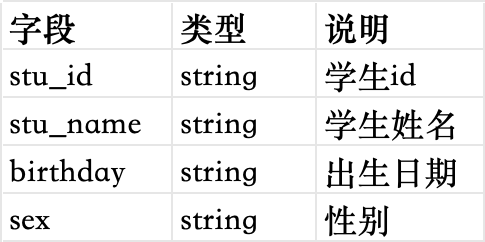

教师表teacher_info

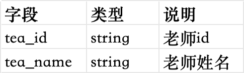

课程表course_info

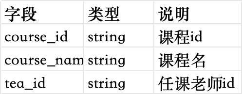

分数表score_info

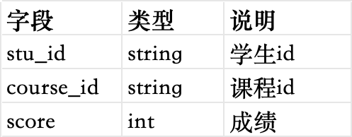

# 基础查询

## 简单查询

### 查询姓名中带“山”字的学生名单

比较简单，考察的是where过滤，配合like模糊查询即可。语句如下

```sql
select * from student_info where stu_name like '%山%';
```

### 查询姓“王”老师的个数

这题考察的是where条件过滤，配合like模糊查询，然后使用count进行计数，语句如下

```sql
select count(1) from teacher_info where tea_name like '王%';
```

### 查询课程编号为“04”且分数小于60的学生的分数信息，结果按照分数降序排列

此题考察的是where条件过滤，然后配合order by实现排序。语句如下

```sql
select * from score_info where course_id='04' and score<60 order by score desc;
```

### 查询数学成绩不合格的学生信息，及对应的数学学科成绩，按照学号升序排序

这个题可以拆分出来好几步，然后整合起来即可。步骤如下：

1. 根据数学这个学科，查询课程表，得到数学学科对应的课程id
2. 根据上一步查询到的数学课程id，以及成绩不合格，作为过滤条件，查询分数表，得到学生id和数学分数
3. 前两步得到的结果，和学生信息表进行join，将学生的详细信息填充到结果中

```sql
select
    t1.*,
    t2.score    
from student_info t1
    join
(select
    stu_id,
    score
from score_info
where course_id=(select course_id from course_info where course_name='数学') and score<60) t2
on t1.stu_id=t2.stu_id
order by t1.stu_id asc;
```

## 分组与汇总

### 查询编号为“02”的课程的总成绩

查询分数表，过滤出课程编号为02的课程，然后按照课程编号进行分组（实际上就只有一个组），然后对组内的分数进行sum求和即可。

```sql
select
    course_id,
    sum(score)
from score_info
where course_id='02'
group by course_id;
```

### 查询参加考试的学生的个数

查询分数表，对参与考试的学生进行计数，但是考虑到一个学生可能会参加多门考试，所以要对结果进行去重。综合下来，可以使用count(distinct)

```sql
select count(distinct stu_id) from score_info;
```

### 查询各科成绩最高分和最低分，以如下形式展示：课程号、最高分、最低分

查询分数表，按照课程id进行分组，通过max求最高分，通过min求最低分。

```sql
select course_id,max(score),min(score) from score_info group by course_id;
```

### 查询每门课程有多少学生参加了考试（有考试成绩）

查询分数表，按照课程id进行分组，然后对学生编号stu_id字段进行求count计数即可。

```sql
select course_id,count(stu_id) from score_info group by course_id;
```

### 查询男生，女生的人数

查询学生表，按照性别sex进行分组，然后对学生编号stu_id进行求count计数即可

```sql
select sex,count(stu_id) from student_info group by sex;
```

### 查询平均成绩大于60分的学生的学号和平均成绩

查询分数表，按照学生编号stu_id进行分组，然后对score分数求avg平均值，然后对求出来的平均值使用having子句进行过滤，过滤出平均成绩大于60分的。

```sql
select
    stu_id,
    avg(score) as avg_score
from score_info
grouy by stu_id
having avg_score>60;
```

### 查询至少考了4门课程的学生学号

查询分数表，按照学生编号stu_id进行分组，然后对课程编号course_id进行count计数统计，对统计出来的聚合结果，使用having子句进行过滤筛选，筛选出总数大于等于4的即可。

```sql
select
    stu_id,
    count(course_id) as ct_course_id
from score_info
group by stu_id
having ct_course_id>=4;
```

### 查询每门课程的平均成绩，结果按照平均成绩升序排序，当平均成绩相同时，按课程号降序排序

查询分数表，按照课程id进行分组，对score分数求平均值，然后在order by子句中，对平均成绩升序排，对课程号降序排。

```sql
select
    course_id,
    avg(score) as avg_score
from score_info
group by course_id
order by avg_score asc,course_id desc;
```

### 统计参加考试的人数大于等于15的学科

查询分数表，按照课程id进行分组，对学生编号进行count计数统计，然后对统计之后的结果使用having子句进行过滤。

```sql
select
    course_id,
    count(stu_id) as ct_stu_id
from score_info
group by course_id
having ct_stu_id>=15;
```

### 查询学生的总成绩并按照总成绩降序排序

查询分数表，按照学生id进行分组，对score分数进行sum统计，然后对统计之后的结果使用order by降序排序即可。

```sql
select
    stu_id,
    sum(score) as sum_score
from score_info
group by stu_id
order by sum_score desc;
```

### 查询一共参加三门课程考试且其中一门为语文课程的学生的id和姓名

此题较为复杂，需要多个步骤综合执行得到结果。具体的分解步骤如下

* 首先通过查询课程表，获得课程名称为“语文”的课程的id
* 然后查询分数表，获得所有参加过语文考试的学生的id
* 有了上一步得到的学生id，查询分数表，将这些学生通过where in子句过滤出来
* 对上一步过滤后剩下的学生按照学生id进行分组，并对课程id进行count计数统计，并通过having子句过滤出只学习了三门课程的学生
* 对上一步得到的学生id，关联join学生表，获得学生的姓名等信息

```sql
--和学生表进行关联，获得学生的其他信息
select
    t1.stu_id,
    t1.stu_name
from student_info t1
join
(
    --获得既学习过语文课程，并且学习总课程数量为3的学生id
    select
        stu_id,
        count(course_id) as ct_course_id
    from score_info where stu_id in (
        --获得学习过语文课程的学生id
        select
            stu_id
        from score_info where course_id=(
            --获得语文课程id
            select course_id from course_info where course_name='语文'
        )
    )
    group by stu_id
    having ct_course_id=3
) t2
on t1.stu_id=t2.stu_id;
```

## 复杂查询

### 查询没有学全所有课程的学生学号和姓名

此题容易出现的思路是先对分数表按照学生编号进行分组，然后对课程进行count计数统计，过滤出所学课程不满足所有课程的学生，然后再和学生表进行关联，获得姓名等信息。乍一看是对的思路，但是有个问题容易忽略，那就是分数表中，有可能有些学生没有学习任何的课程，所以在分数表中，这些学生的数据并不会出现，但是按理来讲，这些学生的信息也是要输出的。所以需要换个思路。

正确的思路是，首先将学生表和分数表进行关联，而且是学生表left join分数表这种方式。然后对join之后的宽表，按照学生表的学生id和姓名进行分组，对分数表的课程id进行count计数统计，然后再使用having子句，过滤出那些没有学全所有课程的学生信息。针对有些没有学习任何课程的学生，在对课程id进行count计数统计的时候，实际上统计的是null值，对null值进行count统计，最终的结果是0。这样就把那些没有学习过任何课程的学生也统计进来了，保证了数据的准确性。

```sql
select
    --对学生表按照学生id和学生姓名进行分组 
    t1.stu_id,
    t1.stu_name,
    --求出分数表中该学生一共学习了几门课程（也包含没有学习过任何课程的学生）
    count(t2.course_id) as ct_course_id
from student_info t1
left join score_info t2
--将学生表和分数表进行关联
on t1.stu_id=t2.stu_id
group by t1.stu_id,t1.stu_name
--过滤出没学全所有课程的
having ct_course_id<(
    --求出所有课程的总数量
    select count(*) from course_info
);
```

### 查询出只选修了三门课程的全部学生的学号和姓名

查询分数表，按照学生id进行分组，对课程id进行count计数统计，通过having子句过滤出只学习了三门课程的学生id，然后再和学生表进行join关联，补全学生的姓名即可。

```sql
select
    t1.stu_id,
    t1.stu_name
from student_info t1
join (
    select
        stu_id,
        count(course_id) as ct_course_id
    from score_info
    group by stu_id
    having ct_course_id=3
) t2
on t1.stu_id=t2.stu_id;
```

## 多表查询

### 查询所有学生的学号，姓名，选课数，总成绩

通过题目的分析，学生的学号，选课数和总成绩，可以通过查询分数表得到。至于姓名，再和学生表进行关联即可。但是同时有个问题，就是有些学生并没有选择学习任何一门课程，那么在分数表中是没有这个学生的数据的。所以为了保险起见，还是采用先让学生表和分数表关联，然后对学生表的学生id和学生姓名分组，对分数表中的课程id进行count计数，对分数表中的score分数进行sum求和。

在进行count计数和sum求和时，如果列为null值，可以使用nvl函数进行判空处理。

```sql
select
    t1.stu_id,
    t1.stu_name,
    --这里需要对null值列进行判空特殊处理
    nvl(count(t2.course_id),0)
    nvl(sum(t2.score),0)
from student_info t1
left join score_info t2
on t1.stu_id=t2.stu_id
group by t1.stu_id,t1.stu_name;
```

### 查询平均成绩大于85的所有学生的学号，姓名和平均成绩

让学生表和分数表进行关联join，得到的宽表，按照学生表的id和姓名进行分组，然后使用avg求出分数表中的score的平均值。再使用having进行过滤即可。

```sql
select
    t1.stu_id,
    t1.stu_name,
    avg(t2.score) as avg_score
from student_info t1
join score_info t2
on t1.stu_id=t2.stu_id
group by t1.stu_id,t1.stu_name
having avg_score>85;
```

### 查询学生的选课情况，按照如下形式输出：学号，姓名，课程号，课程名称

既然是查询学生的选课情况，那么学生表肯定是主表，它里面有的学生信息是必须要输出的。学生的选课情况，就需要学生表和分数表进行关联，获取到该学生所选修的所有课程的id，至于课程的名字，还需要再和课程表进行关联获取到。所以该题是一个三表关联的场景，具体的步骤如下：

* 查询学生表，获取到学生的id和姓名
* 上一步得到的结果和分数表进行关联，获取到学生所对应的选课的课程id
* 上一步得到的结果继续和课程表进行关联，获取到课程的名称

```sql
select
    t1.stu_id,
    t1.stu_name,
    t2.course_id,
    t3.course_name
from student_info t1
--学生表和分数表关联，获取课程id
left join score_info t2
on t1.stu_id=t2.stu_id
--分数表和课程表关联，获取课程名称
left join course_info t3
on t2.course_id=t3.course_id;
```

### 查询课程编号为03且课程成绩在80以上的学生的学号和姓名，以及课程信息

该题也是一个多表联查的场景。根据题目分析，主要有以下几个步骤：

* 查询分数表，通过where过滤出课程id为03的，并且score大于80分的数据
* 上一步得到的结果和学生表通过学生id进行关联，获取到学生的姓名
* 上一步得到的结果和课程表通过课程id进行关联，获取到课程的名称

```sql
select
    t1.stu_id,
    t2.stu_name,
    t1.course_id,
    t3.course_name
from (
    select
        stu_id,
        course_id
    from score_info
    --过滤出来课程id为03且分数大于80的
    where course_id='03' and score>80
) t1
--和学生表关联获取学生姓名
join student_info t2
on t1.stu_id=t2.stu_id
--和课程表关联获取课程名称
join course_info t3
on t1.course_id=t3.course_id;
```

### 查询课程编号为01且课程分数小于60的学生信息，按课程分数降序排列

首先查询分数表，过滤出课程id为01且分数小于60的信息，然后和学生表进行join，补全学生信息。最后根据分数order by

```sql
select
    t2.*,
from (
    select
        stu_id,
        score
    from score_info
    where course_id='01' and score<60
) t1
join student_info t2
on t1.stu_id=t2.stu_id
order by t1.score desc;
```

### 查询所有课程成绩在70分以上（含70分）的学生的姓名，课程名称和分数，并按照分数升序排列

首先分析题目需求，要学生的姓名，那么肯定会和学生表进行关联，要课程的名称，那么肯定会和课程表进行关联。要分数，那么肯定会和分数表进行关联。现在只剩下一个条件，就是如何获得所有课程成绩均在70以上的学生的id

要求得所有课程成绩均在70以上的学生，肯定是从分数表进行查询。我们可以对score分数列，进行if判断，如果分数小于70分，那么记为1，如果大于等于70分，记为0，然后按照学生id进行分组，对这个标记位进行sum求和，如果总和是0，证明该学生所有课程的成绩都是在70分以上的。这样就能获取到学生的id了。然后就是从分数表中过滤出这些学生id的成绩信息，再然后就是顺理成章的和学生表关联获得学生姓名，和课程表关联获得课程名称。

综上，该题的分解步骤如下

* 查询分数表，对score分数列打标记，使用sum(if())函数进行统计，对学生id进行分组，对统计的和进行判断，从而获取到所有课程成绩都在70以上的学生的id
* 上一步获取到的学生id，和分数表进行关联，该将学生的所有课程成绩筛选出来
* 上一步获得的结果和学生表进行关联，获得学生的姓名
* 上一步获得的结果和课程表进行关联，获得课程的名称
* 最后按照分数进行升序排序

```sql
select
    t3.stu_name,
    t4.course_name,
    t2.score
from (
    --通过sum-if结合分组，获取到所有成绩都在70分以上的学生的id
    select
        stu_id,
        sum(if(score>=70,0,1)) as num
    from score_info
    group by stu_id
    having num=0
) t1
--和分数表关联，将所有成绩都在70以上的学生的成绩信息获取到
join score_info t2
on t1.stu_id=t2.stu_id
--和学生表关联，获取学生姓名
join student_info t3
on t2.stu_id=t3.stu_id
--和课程表关联，获取课程名称
join course_info t4
on t2.course_id=t4.course_id
--按照分数表中的分数升序排序
order by t2.score asc;
```

### 查询某学生不同课程但成绩相同的情况下，该学生的编号，课程编号，以及学生成绩

首先分析题目需求，要获得学生的编号，课程编号，以及学生成绩，直接通过查询分数表就可以得到。关键的点在于，怎么筛选出不同的课程，但是成绩相同的同一个学生。

要获得这个需求，是需要同一个学生的前提下，拿不同的课程之间，进行成绩的比较，然后取那些成绩相同的。是自己和自己的比较，所以是一个自连接的应用场景，也就是表自己和自己进行join。

```sql
select
    t1.stu_id,
    t1.course_id,
    t1.score
from score_info t1 
join score_info t2
--学生编号相同
on t1.stu_id=t2.stu_id
--课程编号不同
and t1.course_id!=t2.course_id
--成绩相同
and t1.score=t2.score;
```

### 查询课程编号为01的课程比02的课程成绩高的所有学生的学号

这个需求，是要找同一个学生的前提下，01课程成绩比02课程成绩高的那些学生，所以其实也是一个自连接。只不过自连接有前提条件，就是先把01课程的学生成绩筛选出来，然后把02课程的学生成绩筛选出来，然后让两个查询结果表进行join，关联的条件就是相同的学生id，同时过滤条件是01的课程成绩比02的课程成绩高。

```sql
select 
    t1.stu_id
from 
(select
    stu_id,
    score
from score_info
where course_id='01') t1
join
(select
    stu_id,
    score
from score_info
where course_id='02') t2
on t1.stu_id=t2.stu_id
where t1.score>t2.score;
```

### 查询学过编号为01的课程，并且也学过编号为02的课程的学生的学号和姓名

要获取同时学习过课程01和02的学生，可以拆开求解。先查询分数表，获得学习过01课程的学生id，然后再次查询分数表，获得学习过02课程的学生id，然后让这两个中间表进行join，关联的条件就是学生id相同，就可以获得同时学习过01和02课程的学生id，然后结果再关联学生表，获得姓名即可。

```sql
select
    t3.stu_id,
    t4.stu_name
from (
    select
        t1.stu_id as stu_id
    from
    (select
        stu_id
    from score_info
    where course_id='01') t1
    join
    (select
        stu_id
    from score_info
    where course_id='02') t2
    on t1.stu_id=t2.stu_id
) t3
join student_info t4
on t3.stu_id=t4.stu_id;
```

### 查询学过“张三”老师所教的所有课的学生的学号，姓名

首先分析题目，要查学生的学号和姓名，自然有关联学生表的操作。最主要的是这个条件，如何得到“张三”老师所教的所有的课程？这个可以通过课程表和老师表进行join得到。

有了张三老师所教授的所有的课程id之后，去查询分数表，过滤条件使用in子句，就是课程id在张三老师所教授的所有课程内。但是这样得到的，不是学过张三老师教授的所有课程的学生，而是有可能部分学生只学习过张三老师教授的所有课程中的一门或几门而已，不是全部的课程。为了得到学过张三老师教授的全部课程的学生，在刚才的基础上，在分数表中按照学生id进行分组，对学生对应的课程id进行count计数统计，然后对统计结果进行having子句过滤，如果得到的总数量和张三老师所教授的所有课程的总数量一致，则该学生就是要找的学生。

最后，再对上面得到的学生id结果和学生表关联，获取学生的姓名即可。

综上，此题可分为以下几个步骤

* 让课程表和老师表进行join，得到张三老师所教授的所有课程的id
* 让课程表和老师表进行join，得到张三老师所教授的所有课程的总数量
* 查询分数表，过滤条件是，课程id在张三老师所教授的所有课程id内即可，然后按照学生id进行分组，求count总量计数，同时having子句中过滤，要求总量等于张三老师所教授的所有课程的总量
* 上一步得到的学生id关联学生表，获得学生的姓名

```sql
select 
    t5.stu_id,
    t6.stu_name
from (
    --查询分数表，按照学生id分组，同时要求课程id必须在张三老师所教授的所有课程范围内，顺便对课程id进行统计计数，要求统计的结果和张三老师所教授的所有课程的总量相同
    select 
        stu_id
        count(*) as ct
    from score_info
    where course_id in (
        --求出张三老师所教授的所有课程的id
        select
            t1.course_id
        from course_info t1
        join teacher_info t2
        on t1.tea_id=t2.tea_id
        where t2.tea_name='张三'
    )
    group by stu_id
    having ct=(
        --求出张三老师所教授的所有课程的总数量
        select
            count(*)
        from course_info t3
        join teacher_info t4
        on t3.tea_id=t4.tea_id
        where t4.tea_name='张三'
    )
) t5
--关联学生表，获取姓名
join student_info t6
on t5.stu_id=t6.stu_id;
```

### 查询学过“张三”老师所教授的任意一门课程的学生的学号，姓名

这个需求和上面题目的需求相似，甚至更简单一些。上个题目中，我们在查询分数表的时候，让课程id，通过in子句，在张三老师所教授的所有课程id之内即可。这就已经获得了学过张三老师所教授的任意一门课程的学生id，但是需要额外的处理一步，就是对得到的学生id，进行去重。因为有些学生可能学习了张三老师所教授的所有课程中的多门课程。综合以上，得到的sql如下

```sql
select
    t3.stu_id,
    t4.stu_name
from (
    select
        --这里需要对学生id进行去重，因为有些学生可能学习了多门张三老师的课程
        distinct(stu_id) as stu_id
    from score_info
    where course_id in (
        --求出张三老师所教授的所有课程的id
        select
            t1.course_id
        from course_info t1
        join teacher_info t2
        on t1.tea_id=t2.tea_id
        where t2.tea_name='张三'
    )
) t3
--关联学生表，获得姓名
join student_info t4
on t3.stu_id=t4.stu_id;
```

### 查询没学过“张三”老师教授的任意一门课程的学生姓名

这个题目，和上个题目的需求有关联性，上个题目查询的是学过张三老师教授的任意一门课程的学生，这个题目要求的是没学过张三老师教授的任意一门课程的学生，两者是一个互补的关系。

可以在上个题目的基础上，我们获取到学过张三老师教授的任意一门课程的学生id，然后查询学生表，让学生表中的学生id not in即可。关键的语法是not in

```sql
select 
    stu_id,
    stu_name
from student_info
--查询学生表，把那些学习过张三老师任意一门课程的学生id排除掉，剩下的就是张三老师任意一门都没学过的学生
where stu_id not in (
    select
        --这里需要对学生id进行去重，因为有些学生可能学习了多门张三老师的课程
        distinct(stu_id) as stu_id
    from score_info
    where course_id in (
        --求出张三老师所教授的所有课程的id
        select
            t1.course_id
        from course_info t1
        join teacher_info t2
        on t1.tea_id=t2.tea_id
        where t2.tea_name='张三'
    )
);
```

### 查询至少有一门课程与学号为001的学生所学课程相同的学生的学号和姓名

分析题目，此题还是一个where in子句的使用。我们通过查询分数表，获取到001号学生所学的所有课程id，然后再次查询分数表，让课程id in，也就是存在于001号学生所学的所有课程id的范围内即可。这里需要注意的一点是，第二次查询分数表时，过滤条件中，需要将学号001的学生排除掉。因为自己和自己本来就相同。综上，语句如下

```sql
select
    t2.stu_id,
    t1.stu_name
from student_info t1
join (
    select
        --这里需要注意去重
        distinct(stu_id) as stu_id
    from score_info
    where course_id in (
        select 
            course_id
        from score_info
        where stu_id='001'
    )
    --这里需要注意的是，二次查询时需要将学号001的学生排除 
    and stu_id!='001'
) t2
on t1.stu_id=t2.stu_id;
```

### 按平均成绩从高到低显式所有学生的所有课程的成绩以及平均成绩

此题需要分步骤进行计算。因为要的是所有学生，所以也包含那些从没学过课程的学生，他们的课程分数是null，平均成绩也是null，但是也需要显示出来。所以这里需要将学生表，分数表，以及课程表进行关联。至于平均成绩，需要单独查询分数表，按照学生id进行分组，对score进行avg计算，得到的结果，和上一步的结果按照学生id进行关联即可。只不过会有一个现象就是，每个学生的每门课程，对应的平均成绩是一样的。（仅是展示需要，无业务价值）

```sql
select
    t1.stu_id,
    t1.stu_name,
    t2.course_id,
    t3.course_name,
    t2.score,
    t4.avg_score
from student_info t1
left join score_info t2
on t1.stu_id=t2.stu_id
left join course_info t3
on t2.course_id=t3.course_id
left join (
    select 
        stu_id,
        avg(score) as avg_score
    from score_info
    group by stu_id
) t4
on t2.stu_id=t4.stu_id
order by t4.avg_score desc;
```

# 案例综合练习

首先准备数据如下，建表语句省略，只将用到的表的结构整理如下

用户信息表user_info
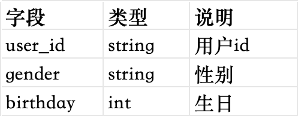

商品信息表sku_info
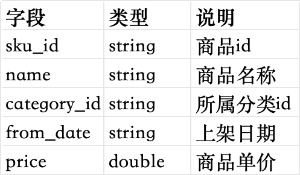

商品分类信息表category_info
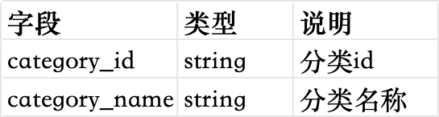

订单信息表order_info
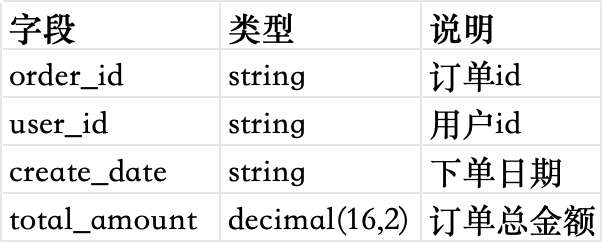

订单明细表order_detail
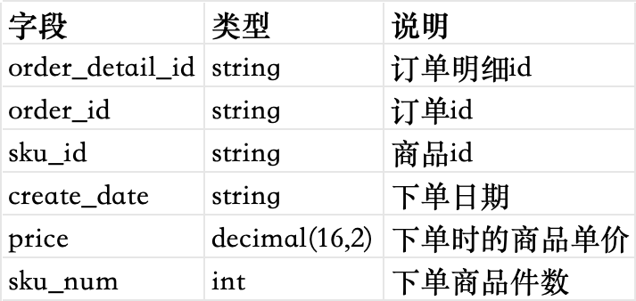

登录明细表user_login_detail
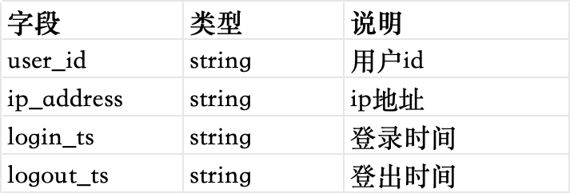

商品价格变更明细表sku_price_modify_detail
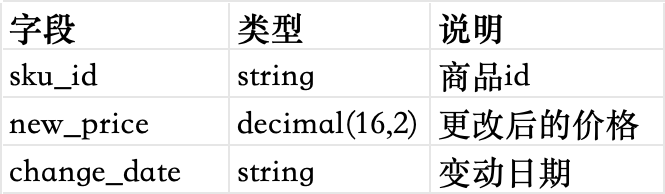

配送信息表delivery_info
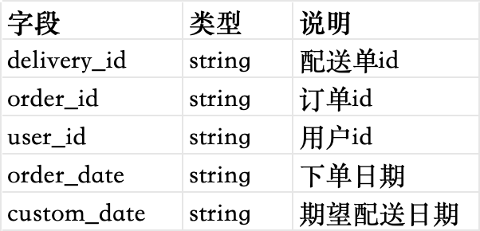

好友关系表friendship_info
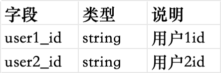

收藏信息表favor_info
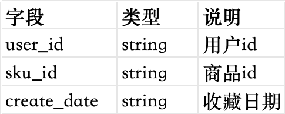

## 初级

### 筛选2021年总销量小于100的商品

分析题目需求，要查询总销量，那么应该从订单明细表中查询。订单明细表中，按照商品id进行分组，对下单商品件数sku_num进行sum求和，使用having过滤出总销量小于100的。同时还有一个限定条件就是，要2021年的数据，所以在where中还要对下单日期进行筛选。

到这一步，还不算完成。因为有些商品，可能上架时间比较晚，比如是2021年的12月31日才刚刚上架，那么统计这种商品的销量显得没有必要。假设现在的日期是2022年1月10号。我们需要对那些上架日期距离当前日期不超过30天的商品进行过滤，不予统计。也就是说，商品的上架日期，必须距离当前日期，大于30天才可以进行总销量的统计。关于商品的上架日期，需要查询商品信息表。

将上面两个步骤得到的中间表进行关联，才是最终想要得到的统计数据。综上，此题可以分解步骤如下

* 查询订单明细表，对下单日期进行过滤，只保留2021年交易的数据。然后按照商品的id进行分组，对商品的下单数量进行sum求和，然后过滤出总量小于100的商品数据。
* 查询商品信息表，对商品的上架日期，和当前日期作差，找出那些大于30天的商品信息。
* 将上面两个步骤得到的表进行关联，整理后输出

```sql
select
    t1.sku_id,
    t2.name,
    t1.sum_sku_num
from (
    --统计出2021年的商品总销量
    select
        sku_id,
        sum(sku_num) as sum_sku_num
    from order_detail
    where year(create_date)=2021
    group by sku_id
    having sum_sku_num<100
) t1
join (
    --找出上架日期距离当前日期大于30天的商品
    select 
        sku_id,
        name
    from sku_info
    where datediff('2022-01-10',from_date)>30
) t2
on t1.sku_id=t2.sku_id;
```

### 查询每日新增用户数

分析题目需求，要统计的是每一天新增的用户数。何为每一天新增的用户数？就是说如果一个用户在某一天登录，而且在这一天之前从没有登录过，那这一天就是该用户的首次登录时间，该用户就是这一天的新增用户。

所以，我们可以先获取到每一个用户的首次登录时间，通过查询登录明细表，按照用户id进行分组，对登录时间取min最小值即可。这里需要注意的是，登录时间的格式是年月日时分秒，我们需要通过格式化，截止到日即可。

然后上一步得到的中间结果表，我们再按格式化后的登录时间进行分组，对用户id求count计数统计即可。这样得到的就是每一天对应的所有新增用户的数量。综上，此题分为以下几个步骤：

* 查询登录明细表，对用户的登录时间进行格式化，截取到“日”，按照用户id进行分组，组内取每个用户登录时间的最小值即可。
* 对上一步得到的结果，再按照登录时间进行分组，然后对用户id求count计数统计即可。

```sql
select
    first_login_ts,
    --求每日下的所有用户数量即全部的新增用户
    count(user_id)
from (
    --找出每个用户首次登录的时间
    select
        user_id,
        date_format(min(login_ts),'yyyy-MM-dd') as first_login_ts
    from user_login_detail
    group by user_id
) t1
--按照用户首次登录的时间分组
group by first_login_ts;
```

### 查询用户的注册日期（即首次登录日期），累积登录次数，以及2021年的累积登录次数，2021年的总下单次数，2021年的总订单金额

分析题目需求，要查询用户的首次登录日期，以及登录总次数，以及2021年的登录总次数，这些需求通过查询用户登录明细表，即可获取。首次登录日期，按用户id分组，取min最小值即可得到，总的登录次数，就是count计数统计，2021年的总登录次数，也还是count计数统计，只不过在count函数中需要使用if函数去判断下登录日期是否属于2021年的。

至于2021年的总下单次数，还有总订单金额，需要查询订单信息表，where条件过滤出来下单日期是2021年的，然后按照用户id进行分组，下单总次数就是求count计数，订单总金额就是sum求和即可。综上，此题的分解步骤如下

* 查询登录明细表，按照用户id进行分组，对登录日期求min最小值获得首次登录日期，对整体求count计数得到总登录次数，对整体求count的同时，使用if函数判断登录日期是否是2021年，计算得出2021年的总登录次数
* 查询订单信息表，使用where过滤出2021年的订单信息，然后按照用户id进行分组，求count计数得到用户2021年的下单总次数，对订单金额求sum得到用户2021年的订单总金额。
* 上面两个步骤得到的中间结果表，按照用户id进行关联，需要注意的是，要使用left join外关联，而且是登录中间表left join订单中间表，因为登录过的用户不一定有订单信息。对于出现的null值，要使用nvl进行处理。

```sql
select
    t1.user_id,
    t1.first_login_ts,
    t1.total_login_count,
    t1.2021_total_login_count,
    --对于null值进行特殊处理
    nvl(t2.2021_total_order_count,0),
    nvl(t2.2021_total_order_amount,0)
from (
    --查询登录明细表获取登录相关信息
    select 
        user_id,
        date_format(min(login_ts),'yyyy-MM-dd') as first_login_ts,
        count(*) as total_login_count,
        --2021年的登录信息，可以在count计数时通过if函数判断，如果有的话就是1，没有要写成null，不能写成0，因为null会参与运算自动视为0
        count(if(year(login_ts)=2021,1,null)) as 2021_total_login_count
    from user_login_detail
    group by user_id
) t1
left join (
    --查询订单信息表，获取下单数和总金额
    select
        user_id,
        count(*) as 2021_total_order_count,
        sum(total_amount) as 2021_total_order_amount
    from order_info
    where year(create_date)=2021
    group by user_id
) t2
on t1.user_id=t2.user_id;
```

### 向用户推荐朋友收藏但自己未收藏的商品

分析题目需求，这个需求和好友关系表，以及收藏信息表有关。如何获得一个人的所有好友呢？自然是通过好友关系表进行查询，但是需要注意的一点是，本题中所提供的好友关系表，在行为上是一个单向的，并不是双向的。比如说，a和b互为好友，但是表中只体现了a的好友是b，并没有b的好友是a这一条数据。所以为了获得具体的好友数据，是需要将好友关系表进行union处理，把单向关系变成双向关系。

具体的做法就是，好友关系表，自身union自身。假设好友关系表的两个字段分别是uid1（代表自身id）和uid2（代表好友id），两张表在union时，在查询字段的顺序上，一张表是uid1，uid2，另一张表是uid2，uid1，这样就能把好友的双向关系进行确定。sql举例如下

```sql
select
    uid1 as my_id,
    uid2 as friend_id 
from friend
union
select
    uid2,
    uid1
from friend;
```

上述sql语句执行之后，结果表中的my_id列就代表自身id，friend_id列就代表好友id。

接下来，将这张双向好友表，和收藏信息表，通过用户id进行关联，获得用户所收藏的所有商品信息。但是关联的时候，要分两次进行关联。一次是拿my_id自身和收藏信息表进行关联，获得的是自身所收藏的所有的商品信息。另一次是拿friend_id好友id和收藏信息表进行关联，获得的是某个用户它所有的好友全部收藏的商品信息。

有了自己收藏的所有的商品信息，和自己全部好友收藏的所有的商品信息 ，这两个中间结果表，再按照自身id和收藏的商品id进行关联，而且是left join外关联，要求自己好友收藏的所有商品信息表在左边，自己收藏的所有商品信息在右边。之所以这样，是因为有些人可能自己并未收藏任何商品，但是他的好友却收藏了很多。把好友收藏的放在左边，避免遗漏数据。

上一步关联之后的表，如果存在自己未收藏的商品，但是自己的好友收藏了，那么在表中必然会出现一种现象就是，好友收藏商品表部分的数据是有的，但是自己收藏商品部分数据是null。而我们通过where将那些自己收藏商品部分是null的数据过滤出来，这些数据中好友收藏商品部分不为null的数据，就是最终要推荐的数据。实际上就是两表join，然后其中一张表的数据is null。这在hive中是一种很常见的用法，通常用来解决存在于a表中但是不存在于b表中的场景。

综上，此题可以拆分步骤如下：

* 好友关系表，自身union自身，将单向好友关系变成双向好友关系。
* 将双向好友关系表和收藏信息表进行join，分两次进行join，一次是拿自身id和收藏信息表进行join，得到自身收藏的所有商品信息表（简称t1）。一次是拿好友id和收藏信息表进行join，得到某个人他全部的好友所收藏的所有商品信息表（简称t2）。
* 将上一步得到的t1和t2，根据自身id和商品id进行join，而且是t2 left join t1，在过滤条件中将t1的自身id为null的数据过滤出来，得到最终的结果。

```sql
select
    --对得到的结果数据进行去重
    distinct t2.my_id,t2.sku_id
from (
    --获得一个人他所有好友收藏的全部商品信息
    select
        t1.my_id as my_id,
        favor_info.sku_id as sku_id
    from (
        --获得双向好友关系表
        select
            user1_id as my_id,
            user2_id as friend_id
        from friendship_info
        union
        select
            user2_id,
            user1_id
        from friendship_info
    ) t1
    join favor_info
    --注意这里的关联条件是好友id
    on t1.friend_id=favor_info.user_id
) t2
left join (
    --获得一个人他自身收藏的全部商品信息
    select
        t1.my_id as my_id,
        favor_info.sku_id as sku_id
    from (
        --获得双向好友关系表
        select
            user1_id as my_id,
            user2_id as friend_id
        from friendship_info
        union
        select
            user2_id,
            user1_id
        from friendship_info
    ) t1
    join favor_info
    --注意这里的关联条件是自身id
    on t1.my_id=favor_info.user_id
) t3
--关联条件要自身id和商品id相同
on t2.my_id=t3.my_id and t2.sku_id=t3.sku_id
--过滤出那些好友收藏商品有但是自身收藏商品没有的数据
where t3.my_id is null;
```

### 统计男性和女性每日购物总金额

此题要求的输出结果是，日期，男性购物总金额，女性购物总金额。根据题目需求，应该查询的是订单信息表，里面包含了用户的下单日期以及订单总金额。还应该查询用户信息表，因为里面包含了性别信息。

综上所述，让订单信息表和用户信息表，按照用户id进行关联，得到一张汇总了用户性别信息的订单宽表。然后按照下单日期进行分组，分别对男性和女性的购物总金额进行求和。这里使用到了sum(if())函数，在sum求和的过程中，通过if函数判断性别信息，如果是男性，则累加到男性购物总金额中，如果是女性，则累加到女性购物总金额中。语句如下

```sql
select
    t1.create_date,
    sum(if(t2.gender='男',t1.total_amount,0)) as male_total_amount,
    sum(if(t2.gender='女',t1.total_amount,0)) as female_total_amount
from order_info t1
join user_info t2
on t1.user1_id=t2.user1_id
group by t1.create_date;
```

### 查询购买过商品1和商品2但是没有购买过商品3的顾客信息

分析题目需求，需要查询购买的商品信息的用户，那么会使用到订单信息表，还会使用到订单明细表。订单信息表中，有用户id和订单id，订单明细表中，有订单id和商品id，两张表可以通过订单id进行关联，那么就会得到用户所购买的商品信息。

在上一步关联得到的中间结果表基础上，按照用户id进行分组，把商品id通过收集函数collect_set，放入到集合中。看题目需求，购买过商品1和商品2，但是没有购买过商品3，可以使用数组函数array_contains来对集合中的内容进行判断。语句如下

```sql
select
    t3.user_id
from (
    --将订单信息表和订单明细表进行关联，获取到每个用户购买的所有商品信息
    select
        t1.user_id as user_id,
        --所有的商品信息放到一个集合中
        collect_set(t2.sku_id) as skus
    from order_info t1
    join order_detail t2
    on t1.order_id=t2.order_id
    group by t1.user_id
) t3
--通过array_contains函数进行判断
where array_contains(t3.skus,'1')
and array_contains(t3.skus,'2')
and not array_contains(t3.skus,'3');
```

### 统计每日商品1和商品2销量的差值

分析题目需求，我们要首先得到每日商品1和商品2的总销量，需要查询订单明细表，首先通过where条件过滤出商品id是1和2的，然后按照下单日期进行分组，对商品1和商品2的总销量，分别使用sum(if())函数求和值，然后再作差即可。语句如下

```sql
select
    create_date,
    --使用sum-if分别统计商品1和商品2的销量，然后作差
    sum(if(sku_id='1',sku_num,0)) - sum(if(sku_id='2',sku_num,0)) as diff
from order_detail
--提前过滤出来只包含商品1和商品2的数据
where sku_id in ('1','2')
group by create_date;
```

### 统计每个商品的销量，根据销量划分等级（0-5000冷门，5001-19999一般，20000以上热门），并统计不同级别的商品数量

分析题目需求，要统计每个商品的销量，会使用到订单明细表，根据商品id进行分组，对下单数量进行sum求和。

然后对上一步得到的结果，判断每个商品的销量所属的数量范围，然后打上冷门，一般或者热门的标签。这个地方属于分门别类的判断，所以可以通过case when来实现。这样，每个商品所属的等级就知道了。

最后对上一步得到的结果，按照等级进行分组，对商品数量求count计数统计即可。语句如下

```sql
select 
    t2.flag,
    --按等级进行分组，求每个等级下的商品的总数
    count(*)
from (
    --对每个商品的总销量，按照范围进行等级划分
    select
        t1.sku_id as sku_id,
        case
            when t1.sum_sku_num <=5000 then '冷门'
            when t1.sum_sku_num > 5000 and t1.sum_sku_num < 20000 then '一般'
            when t1.sum_sku_num >=20000 then '热门'
        end as flag
    from (
        --获取每个商品的总销量
        select
            sku_id,
            sum(sku_num) as sum_sku_num
        from order_detail
        group by sku_id
    ) t1
) t2
--按等级进行分组
group by t2.flag;
```

### 查询有新增用户日期的新增用户数，以及新增用户的一日留存率

先来解释下什么是一日留存，好比某个用户a，在1号这天登录了，在2号这天也登录了，则用户a满足一日留存。一日留存率就是个比例值，好比1号这天一共登录了10个用户，但是在2号这天只有4个用户登录了，则1号到2号的一日留存率就是40%。

接下来分析题目，有2个需求，一个是某日期下的新增用户数量。另一个是新增用户数量的留存率。先来看第一个需求，要查询所有登录日期下的新增用户数量，需要查询登录明细表。对表中的数据按照用户id和登录时间进行去重，保证一个用户在一天下的所有登录只保留一条信息即可。然后对去重得到的表，需要借助窗口函数lag和lead，按用户id进行分组，按登录时间进行升序排序，这样可以得到一个用户每次连续登录的多条时间记录。这多条记录，需要体现出上一次登录时间（使用lag实现），当前登录时间，以及下一次的登录时间（使用lead实现）。

在上一步得到的一个用户的多条连续登录表中，要过滤出来一条首次登录的记录（首次登录的体现就是通过lag函数获取到的登录时间为null），找到该条记录后，要计算一下首次登录时间和下一次最近的登录时间之间的差值。

在上一步得到的结果表中，按照登录时间进行分组，对用户id求count计数即可得到当天日期下所有的新增用户数，第一个需求解决。接下来看第二个需求，需要计算留存率，在刚才的计算基础之上，就是按照登录时间进行分组，然后对用户id进行count统计，得到的是当天所有的登录用户数，我们还需要知道有哪些用户在当天之后的第二天也登录了，上一步得到的结果表中，是有登录日期和下一次登录日期之间的差值的，我们使用count计数统计，同时结合if函数判断，找出差值为1天的进行统计，如果不是1天则记为null，这样就可以得到连续两天登录的用户数了。然后用这个连续两天登录的用户数除以刚刚计算得到的当天用户登录总数，就得到了留存率。

综上分析，sql语句如下

```sql
select
    t3.login_ts,
    --计算得出当前总共有多少用户登录
    count(*) as total_user_login_count,
    --通过count计数统计，但是只统计那些时间间隔是1天的用户，然后除以当天登录的用户总数，就是1日留存率
    count(if(t3.diff=1,1,null)) / count(*) as remain_1day_percent
from (
    select
        t2.user_id,
        t2.login_ts,
        --通过用户的下一次登录时间和当前登录时间作差，求出登录间隔天数
        datediff(t2.next_date,t2.login_ts) as diff
    from (
        select
            t1.user_id,
            --通过lag函数找到用户上一次最近的登录时间
            lag(t1.login_ts) over (partition by t1.user_id order by t1.login_ts) as prev_date,
            --用户当前的登录时间
            t1.login_ts,
            --通过lead函数找到用户下一次最近的登录时间
            lead(t1.login_ts) over (partition by t1.user_id order by t1.login_ts) as next_date
        from (
            --对登录明细表进行去重，一个用户一天的登录只保留一条信息
            select
            distinct user_id,date_format(login_ts,'yyyy-MM-dd') as login_ts
            from user_login_detail
        ) t1
    ) t2
    --通过上一次登录时间为null，来过滤出用户首次登录这条记录
    where t2.prev_date is null
) t3
--按照登录时间进行分组
group by t3.login_ts;
```

### 


## 中级

## 高级


