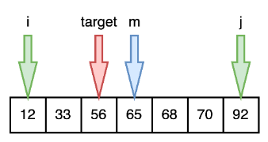

# 二分查找

需求：在有序数组`A`内，查找值`target`。如果找到返回索引，如果找不到返回`-1`

算法的描述：

前提条件就是给定一个内含`n`个元素的有序数组`A`，满足A<sub>0</sub><=A<sub>1</sub><=A<sub>2</sub><=...<=A<sub>n-1</sub>，除此之外，还有一个待查找的值`target`。

我们设置两个指针，`i`和`j`，其中`i`从索引下标`0`开始，`j`从索引下标`n-1`开始。

`i`从数组头部向后移动，`j`从数组尾部向前移动，如果`i>j`，则证明没有找到，结束查找。

设置一个中间索引`m`，其值等于`(i+j)/2`，且向下取整。

如果target<A<sub>m</sub>，则表示要查找的目标值在数组中间的左侧，此时应该让`j=m-1`

如果target>A<sub>m</sub>，则表示要查找的目标值在数组中间的右侧，此时应该让`i=m+1`

如果target=A<sub>m</sub>，则表示数组中间的值正好是要查找的值，结束查找。



算法的实现：

上述算法描述的思想通过代码展示如下

```java
/**
 * 二分查找
 * @param nums 待查询的数组
 * @param target 待查找的目标值
 * @return 目标值的索引
 */
public static int binarySearch(int[] nums, int target) {
    //设置开始索引是数组的头部
    int i = 0;
    //设置结束索引是数组的尾部
    int j = nums.length - 1;
    //只要满足 i <= j，就代表查找并没有结束
    while (i <= j) {
        //取数组中间索引位置，向下取整，这里最好写成 (i+j) >>> 1
        int m = (i + j) / 2;
        //如果目标值大于数组中间值，则代表目标值在中间位置的右侧，那么下一轮开始查找的位置应该从 m + 1 开始
        if (target > nums[m]) {
            i = m + 1;
            //如果目标值小于数组中间值，则代表目标值在中间位置的左侧，那么下一轮结束查找的位置应该截止到 m - 1
        } else if (target < nums[m]) {
            j = m - 1;
        } else {
            //如果目标值正好等于数组中间值，则索引m就是要返回的索引
            return m;
        }
    }
    //数组中没有查找到目标值，索引返回-1
    return -1;
}
```

这个算法的代码，有几个地方是需要注意和改进的：

（1）循环条件，是`i<=j`，而不能是`i<j`，因为在某些情况下，比如要查找的目标值是数组的首个元素，如果没有等于这个限制，则整个循环并不会遍历到数组的首个元素，也就是说`j`的取值，是不可能和`i`重叠的，但恰巧最后一步`i`和`j`的重叠元素，计算出来的`m`就是`i`和`j`指向的元素。所以如果没有等于这个条件，该算法是有瑕疵的，要特别注意。

（2）中间索引，我们定义的中间索引`m`取值是`(i+j)/2`，但是当数组中的元素数量非常多时，这个计算可能会导致出现负数的情况，这个原因是由于计算机二进制数的表现形势导致的。所以为了避免这个问题，可以采用位右移运算符来解决。就是将`(i+j)/2`替换为`(i+j)>>>1`。

# 如何衡量算法的好坏


